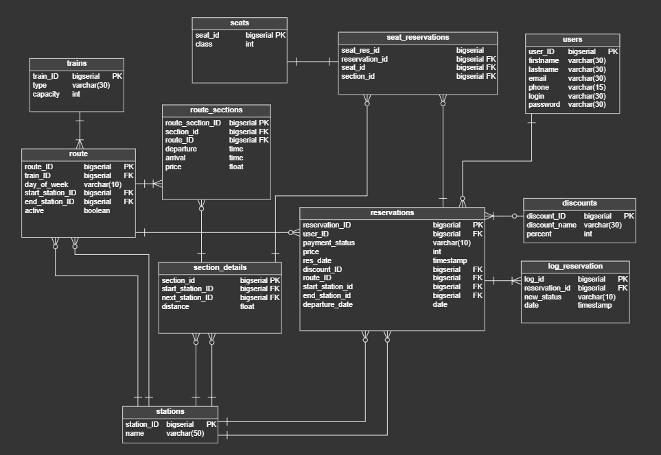
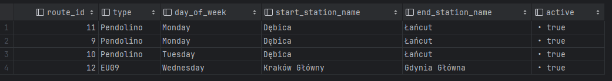
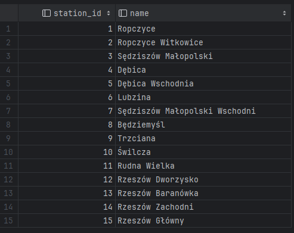
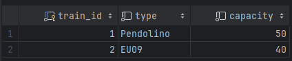
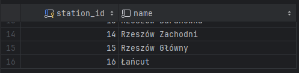
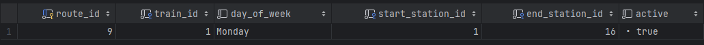
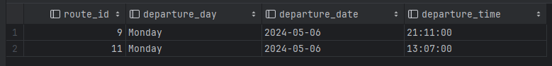
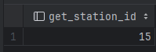

## Spis treści
- [Tabele](#tabele)
  - [Tabela discounts](#tabela-discounts)
  - [Tabela log\_reservation](#tabela-log_reservation)
  - [Tabela reservations](#tabela-reservations)
  - [Tabela route](#tabela-route)
  - [Tabela route\_sections](#tabela-route_sections)
  - [Tabela seat\_reservations](#tabela-seat_reservations)
  - [Tabela seats](#tabela-seats)
  - [Tabela section\_details](#tabela-section_details)
  - [Tabela stations](#tabela-stations)
  - [Tabela trains](#tabela-trains)
  - [Tabela users](#tabela-users)
- [Widoki](#widoki)
  - [Widok all\_routes](#widok-all_routes)
  - [Widok all\_stations](#widok-all_stations)
- [Procdeury](#procdeury)
  - [add\_train](#add_train)
  - [add\_station](#add_station)
  - [add\_route](#add_route)
  - [add\_user](#add_user)
  - [add\_discount](#add_discount)
  - [add\_seat](#add_seat)
  - [station\_exists](#station_exists)
  - [add\_section\_details](#add_section_details)
  - [add\_section\_details\_both\_ways](#add_section_details_both_ways)
  - [add\_route\_section](#add_route_section)
  - [change\_route\_status](#change_route_status)
  - [add\_reservation](#add_reservation)
  - [update\_user\_password](#update_user_password)
- [Funkcje](#funkcje)
  - [find\_routes](#find_routes)
  - [user\_reservations](#user_reservations)
  - [route\_passengers](#route_passengers)
  - [section\_exists](#section_exists)
  - [section\_distance](#section_distance)
  - [get\_station\_id](#get_station_id)
  - [count\_sum\_price](#count_sum_price)
  - [get\_departure\_time](#get_departure_time)
  - [get\_route\_sections](#get_route_sections)
  - [get\_occupied\_seats](#get_occupied_seats)
- [Triggery](#triggery)
  - [status\_insert\_trigger](#status_insert_trigger)

## Schemat bazy danych 



# Tabele

## Tabela discounts

Tabela zawiera wszystkie możliwe zniżki na bilety.

`discount_ID` - ID zniżki <br>
`discount_name` - nazwa zniżki <br>
`percent` - procent zniżki <br>

Implementacja:
```sql 
CREATE TABLE discounts (
    discount_ID bigserial  NOT NULL,
    discount_name varchar(30)  NOT NULL,
    percent int  NOT NULL,
    CONSTRAINT discounts_pk PRIMARY KEY (discount_ID)
);
```
## Tabela log_reservation

Tabela zawiera logi zmiany statusu rezerwacji. 

`log_id` - ID logowania rezerwacji <br>
`reservation_id` - ID rezerwacji <br>
`new_status` - nowy status <br>
`date` - data <br>

Implementacja:
```sql
CREATE TABLE log_reservation (
    log_id bigserial  NOT NULL,
    reservation_id bigserial  NOT NULL,
    new_status varchar(10)  NOT NULL,
    date timestamp  NOT NULL,
    CONSTRAINT log_reservation_pk PRIMARY KEY (log_id)
);
```
## Tabela reservations

Tabela zawiera rezerwacje biletów na pociągi. 

`reservation_ID` - ID rezerwacji <br>
`user_ID` - ID użytkownika <br>
`payment_status` - status płatności <br>
`price` - cena <br>
`res_date` - data rezerwacji <br>
`discount_ID` - ID zniżki <br>
`route_ID` - ID trasy <br>
`start_station_id` - ID stacji początkowej <br>
`end_station_id` - ID stacji końcowej <br>
`departure_date` - data wyjazdu <br>

Implementacja:
```sql 
CREATE TABLE reservations (
    reservation_ID bigserial  NOT NULL,
    user_ID bigserial  NOT NULL,
    payment_status varchar(10)  NOT NULL,
    price int  NOT NULL,
    res_date timestamp  NOT NULL,
    discount_ID bigserial  NOT NULL,
    route_ID bigserial  NOT NULL,
    start_station_id bigserial  NOT NULL,
    end_station_id bigserial  NOT NULL,
    departure_date date  NOT NULL,
    CONSTRAINT reservations_pk PRIMARY KEY (reservation_ID)
);
```
## Tabela route

Tabela zawiera ogólne trasy pociagów. 

`route_ID` - ID trasy <br>
`train_ID` - ID pociągu <br>
`day_of_week` - dzień tygodnia <br>
`start_station_ID` - ID stacji początkowej <br>
`end_station_ID` - ID stacji końcowej <br>
`active` - czy trasa jest aktywna <br>

Implementacja:
```sql 
CREATE TABLE route (
    route_ID bigserial  NOT NULL,
    train_ID bigserial  NOT NULL,
    day_of_week varchar(10)  NOT NULL,
    start_station_ID bigserial  NOT NULL,
    end_station_ID bigserial  NOT NULL,
    active boolean  NOT NULL,
    CONSTRAINT route_pk PRIMARY KEY (route_ID)
);
```
## Tabela route_sections

Tabela zawiera dokładne dane dla danej trasy pociągu. 

`route_section_ID` - ID odcinka trasy <br>
`section_id` - ID odcinka <br>
`route_ID` - ID trasy <br>
`departure` - czas odjazdu  <br>
`arrival` - czas przyjazdu <br>
`price` - cena <br>

Implementacja:
```sql 
CREATE TABLE route_sections (
    route_section_ID bigserial  NOT NULL,
    section_id bigserial  NOT NULL,
    route_ID bigserial  NOT NULL,
    departure time  NOT NULL,
    arrival time  NOT NULL,
    price float  NOT NULL,
    CONSTRAINT route_sections_pk PRIMARY KEY (route_section_ID)
);
```
## Tabela seat_reservations

Tabela zawiera rezerwacje miejsca dla konkretnego bileu. 

`seat_res_id` - ID rezerwacji miejsca <br>
`reservation_id` - ID rezerwacji <br>
`seat_id` - ID miejsca <br>
`section_id` - ID odcinka <br>

Implementacja:
```sql 
CREATE TABLE seat_reservations (
    seat_res_id bigserial  NOT NULL,
    reservation_id bigserial  NOT NULL,
    seat_id bigserial  NOT NULL,
    section_id bigserial  NOT NULL
);
```
## Tabela seats

Tabela zawiera dostępne miejsca w pociągach.

`seat_id` - ID miejsca <br>
`class` - klasa <br>

Implementacja:
```sql
CREATE TABLE seats (
    seat_id bigserial  NOT NULL,
    class int  NOT NULL,
    CONSTRAINT seats_pk PRIMARY KEY (seat_id)
);
```

## Tabela section_details

Tabela zawiera odcinki po których jeżdzą pociagi. 

`section_id` - ID sekcji <br>
`start_station_ID` - ID stacji początkowej <br>
`next_station_ID` - ID następnej stacji <br>
`distance` - odległość <br>

Implementacja:
```sql
CREATE TABLE section_details (
    section_id bigserial  NOT NULL,
    start_station_ID bigserial  NOT NULL,
    next_station_ID bigserial  NOT NULL,
    distance float  NOT NULL,
    CONSTRAINT section_details_pk PRIMARY KEY (section_id)
);
```
## Tabela stations

Tabela słownikowa przechowująca wszystkie obsługiwane stacje. 

`station_ID` - ID stacji <br>
`name` - nazwa <br>

Implementacja:
```sql 
CREATE TABLE stations (
    station_ID bigserial  NOT NULL,
    name varchar(50)  NOT NULL,
    CONSTRAINT stations_pk PRIMARY KEY (station_ID)
);
```

## Tabela trains

Tabela przechowuje wszystkie pociągi. 

`train_ID` - ID pociągu <br>
`type` - nazwa pociągu <br>
`capacity` - pojemność <br>

Implementacja:
```sql
CREATE TABLE trains (
    train_ID bigserial  NOT NULL,
    type varchar(30)  NOT NULL,
    capacity int  NOT NULL,
    CONSTRAINT trains_pk PRIMARY KEY (train_ID)
);
```
## Tabela users

Tabela przechowuje dane o użytkownikach. 

`user_ID` - ID użytkownika <br>
`firstname` - imię <br>
`lastname` - nazwisko <br>
`email` - email <br>
`phone` - telefon <br>
`login` - login <br>
`password` - hasło <br>

Implementacja:
```sql
CREATE TABLE users (
    user_ID bigserial  NOT NULL,
    firstname varchar(30)  NOT NULL,
    lastname varchar(30)  NOT NULL,
    email varchar(30)  NOT NULL,
    phone varchar(15)  NOT NULL,
    login varchar(30)  NOT NULL,
    password varchar(30)  NOT NULL,
    CONSTRAINT users_pk PRIMARY KEY (user_ID)
);
```

# Widoki

## Widok all_routes

Widok zawiera informacje o wszystkich trasach pociągu. 

Implementacja: 
```sql
create or replace view public.all_routes (route_id, type, day_of_week, start_station_name, end_station_name, active) as
SELECT route.route_id,
       trains.type,
       route.day_of_week,
       start_station.name AS start_station_name,
       end_station.name   AS end_station_name,
       route.active
FROM route
         JOIN trains ON route.train_id = trains.train_id
         JOIN stations start_station ON route.start_station_id = start_station.station_id
         JOIN stations end_station ON route.end_station_id = end_station.station_id;
```

Przykładowy widok:



## Widok all_stations

Widok zawiera wszystkie możliwe stacje po których poruszają sie pociągi. 

Implementacja: 
```sql
create or replace view public.all_stations(station_id, name) as
SELECT stations.station_id,
       stations.name
FROM stations;
```

Przykładowy widok: 



# Procdeury

## add_train

Funkcja przyjmuje nazwę pociagu oraz jego pojemność i dodaje ten pociąg do bazy. 

Implementacja: 
```sql
create or replace procedure public.add_train(IN _type character varying, IN _capacity integer)
    language plpgsql
as
$$
BEGIN
    INSERT INTO trains(type, capacity)
    VALUES (_type, _capacity);
END;
$$;
```

Przykładowe wywołanie:
```sql
CALL add_train('EU09', 40);
```

Wynik: 



## add_station

Funkcja przyjmuje nazwę stacji i dodaje ją do bazy.

Implementacja: 
```sql
create or replace procedure public.add_station(IN _name character varying)
    language plpgsql
as
$$
BEGIN
    IF EXISTS(SELECT 1 FROM stations WHERE name = _name) THEN
        RAISE EXCEPTION 'Such station already exists in database!';
    ELSE
        INSERT INTO stations (name)
        VALUES (_name);
    end if;
END;
$$;
```

Przykładowe wywołanie:
```sql
CALL add_station('Łańcut');
```

Wynik: 




## add_route

Procedura dodaje nową trasę.
Procedura sprawdza 
- czy stacja początkowa i końcowa istnieją
- czy taka trasa już nie jest w bazie
- <span style="color: red">sprawdzanie czy pociag jest dostepny TODOTODO</span> 

Implementacja: 
```sql
create or replace procedure public.add_route(IN _train_id integer, IN _day_of_week character varying, IN _start_station_name character varying, IN _end_station_name character varying)
    language plpgsql
as
$$
DECLARE
    v_start_station_id INT;
    v_end_station_id INT;
BEGIN
    IF EXISTS(SELECT 1 FROM trains WHERE train_id = _train_id) THEN
        v_start_station_id := get_station_id(_start_station_name);
        IF v_start_station_id IS NULL THEN
            RAISE EXCEPTION 'Start station "%" does not exist!', _start_station_name;
        END IF;

        v_end_station_id := get_station_id(_end_station_name);
        IF v_end_station_id IS NULL THEN
            RAISE EXCEPTION 'End station "%" does not exist!', _end_station_name;
        END IF;

        IF EXISTS(SELECT 1 FROM route
                  WHERE train_id = _train_id
                    AND day_of_week = _day_of_week
                    AND start_station_id = v_start_station_id
                    AND end_station_id = v_end_station_id) THEN
            RAISE EXCEPTION 'Route already exists with these parameters.';
        ELSE
            INSERT INTO route(train_id, day_of_week, start_station_id, end_station_id, active)
            VALUES (_train_id, _day_of_week, v_start_station_id, v_end_station_id, TRUE);
        END IF;
    ELSE
        RAISE EXCEPTION 'There is no train with ID %', _train_id;
    END IF;
END;
$$;
```

Przykładowe wywołanie: 
```sql
CALL add_route(1, 'Monday', 'Ropczyce', 'Łańcut');
```

Wynik: 



## add_user
Dodaje użytkownika o podanych parametrach
```sql
create procedure add_user(IN _firstname character varying, IN _lastname character varying, IN _email character varying, IN _phone character varying, IN _login character varying, IN _password character varying)
    language plpgsql
as
$$
begin

    insert into users(firstname, lastname, email, phone, login, password)
    values (_firstname,_lastname,_email,_phone,_login,_password);

end $$;

```

## add_discount

Dodaje zniżkę o podanej nazwie oraz procencie zniżki
```sql
create procedure add_discount(IN _discount_name character varying, IN _percent integer)
    language plpgsql
as
$$
begin

    insert into discounts(discount_name, percent)
    values (_discount_name,_percent);

end $$;
```

## add_seat

Dodaje miejsce do tabeli seats
```sql
create procedure add_seat(IN _class integer, IN _seat_number integer)
    language plpgsql
as
$$
begin

    insert into seats(class, seat_number)
    values (_class,_seat_number);

end $$;

alter procedure add_seat(integer, integer) owner to ula;


```
## station_exists

Jeśli stacja o danym id nie istnieje, procedura zwraca wyjątek
```sql

CREATE procedure station_exists(_station_id int)
    LANGUAGE plpgsql
AS $$
BEGIN
    if not exists(select * from stations where station_id=_station_id) then
        raise exception 'Station does not exist';
    end if;
END;
$$;
```

## add_section_details

Dodaje szczegóły dla danego odcinka: stację początkową, końcową oraz dystans

```sql
create procedure add_section_details(IN _start_station_id integer, IN _next_station_id integer, IN _distance double precision)
    language plpgsql
as
$$
begin
    call station_exists(_start_station_id);
    call station_exists(_next_station_id);

    if(section_exists(_next_station_id,_start_station_id)
        and section_distance(_next_station_id,_start_station_id)!=_distance) then
        raise exception 'This route section already exists the other way and distances do not match!';

    end if;

    insert into section_details(start_station_id, next_station_id, distance)
    values (_start_station_id, _next_station_id, _distance);

end $$;
```

## add_section_details_both_ways
Dodaje szczegóły dla danego odcinka w obie strony
```sql
create procedure add_section_details_both_ways(IN _start_station_id integer, IN _next_station_id integer, IN _distance double precision)
    language plpgsql
as
$$
begin
    call station_exists(_start_station_id);
    call station_exists(_next_station_id);
    insert into section_details(start_station_id, next_station_id, distance)
    values (_start_station_id, _next_station_id, _distance);


    insert into section_details(start_station_id, next_station_id, distance)
    values (_next_station_id, _start_station_id, _distance);

end $$;
```

## add_route_section

Dodaje odcinek konkretnej trasy do tabeli route_sections

```sql
create procedure add_route_section(IN _section_id integer, IN _route_id integer, IN _departure time without time zone, IN _arrival time without time zone, IN _price double precision)
    language plpgsql
as
$$
begin

    insert into route_sections(section_id, route_id, departure, arrival, price)
    values (_section_id, _route_id , _departure , _arrival,
            _price );

end $$;
```

## change_route_status

Jeżeli trasa jest aktywna, to ją dezaktywuje, w przeciwnym wypadku zmienia jej status na aktywną. 

```sql
create procedure change_route_status(IN _route_id bigint)
    language plpgsql
as
$$
DECLARE
    curr_status boolean;
BEGIN
    IF EXISTS(SELECT * FROM route WHERE route_id = _route_id) THEN

        SELECT active INTO curr_status FROM route WHERE route_id = _route_id;

        IF curr_status IS NOT TRUE THEN
            UPDATE route
            SET active = true
            WHERE route_id = _route_id;
        ELSE
            UPDATE route
            SET active = false
            WHERE route_id = _route_id;
        END IF;
    ELSE
        RAISE EXCEPTION 'Route with ID %, does not exists!', _route_id;
    END IF;
END;
$$;
```

Przykładowe użycie: 
```sql
CALL change_route_status(9);
```

## add_reservation
Procedura dodaje rezerwację dla podanego użytkownika, trasy, zniżki oraz stacji początkowych i końcowych, a także dodaje do tabeli seat_reservations informację o wszystkich odcinkach, na które zarezerwowane jest dane miejsce.
```sql
create procedure add_reservation(IN _user_id bigint, IN _discount_id bigint, IN _route_id bigint, IN _start_station_id bigint, IN _end_station_id bigint, IN _departure_date date, IN _seat_id bigint)
    language plpgsql
as
$$
declare
    t_section BIGINT;
    _reservation_id BIGINT;
BEGIN

    if _departure_date=CURRENT_DATE then
        if get_departure_time(_start_station_id,_route_id)<CURRENT_TIME
            then
            raise exception 'Cannot book a past route!';
        end if;
    end if;

    if _seat_id in (select *
                    from get_occupied_seats(_route_id,_start_station_id,
                                            _end_station_id,_departure_date)) then
        raise exception 'This seat is already occupied!';
    end if;

    INSERT INTO reservations(  user_id, payment_status, price, res_date, discount_id, route_id, start_station_id, end_station_id, departure_date)
    VALUES (_user_id,DEFAULT,
            count_sum_price(_discount_id,_route_id,
                            _start_station_id,_end_station_id),
            current_timestamp, _discount_id, _route_id, _start_station_id, _end_station_id, _departure_date)
    RETURNING reservation_id INTO _reservation_id;


    FOR t_section IN  (select * from get_route_sections(_route_id, _start_station_id,
                                                  _end_station_id))
    LOOP
            RAISE NOTICE 'Hello, world!';
            INSERT INTO seat_reservations(reservation_id, seat_id, section_id)
            values (_reservation_id,_seat_id,t_section);
    end loop;

END;
$$;
```

## update_user_password

Procedura przyjmuje login i nowe hasło użytkownika i jeżeli użytkownik istnieje to zmienia jego hasło.

Implementacja: 
```sql
create or replace procedure update_user_password(_login varchar(30), _new_password varchar(30))
language plpgsql
as
$$
BEGIN
    IF EXISTS(SELECT * FROM users WHERE login = _login) THEN
        UPDATE users
        SET password = _new_password
        WHERE login = _login;
    ELSE
        RAISE EXCEPTION 'User with login % does not exists', _login;
    end if;
end;
$$;
```

Przykładowe użycie: 

```sql
CALL update_user_password('alicesmith', 'alamakota124');
```


# Funkcje

## find_routes

Implementacja: 
```sql
create function find_routes(_departure_date date, _start_station_id bigint, _end_station_id bigint)
    returns TABLE(route_id bigint, departure_day character varying, departure_date date, departure_time time without time zone, arrival_time time without time zone, price double precision)
    language plpgsql
as
$$
DECLARE
    _day varchar(10);
    _discount BIGINT;
BEGIN


    SELECT to_char(_departure_date, 'Day') INTO _day;

    CREATE TEMP TABLE starts ON COMMIT DROP AS (
        SELECT route.route_id, section_details.start_station_id, next_station_id, day_of_week
        FROM route_sections
        INNER JOIN section_details ON route_sections.section_id = section_details.section_id
        INNER JOIN route ON route_sections.route_id = route.route_id
        WHERE section_details.start_station_id = _start_station_id AND trim(day_of_week) = trim(_day)
    );

    CREATE TEMP TABLE ends ON COMMIT DROP AS (
        SELECT route.route_id, section_details.start_station_id, next_station_id, day_of_week, arrival
        FROM route_sections
        INNER JOIN section_details ON route_sections.section_id = section_details.section_id
        INNER JOIN route ON route_sections.route_id = route.route_id
        WHERE section_details.next_station_id = _end_station_id AND trim(day_of_week) = trim(_day)
    );

    select discount_id into _discount
    from discounts where percent=0;

    RETURN QUERY (
        SELECT starts.route_id, starts.day_of_week, _departure_date, route_sections.departure, ends.arrival,
               count_sum_price(_discount, starts.route_id, _start_station_id, _end_station_id)
        FROM starts
        INNER JOIN ends ON starts.route_id = ends.route_id
        INNER JOIN route_sections ON route_sections.route_id = starts.route_id
        INNER JOIN section_details ON route_sections.section_id = section_details.section_id
        WHERE trim(starts.day_of_week) = trim(ends.day_of_week) AND section_details.start_station_id = _start_station_id 
          AND route_sections.departure<=ends.arrival
        order by route_sections.departure
    );

END;
$$;
```

Przykładowe użycie: 
```sql
SELECT * FROM find_routes('2024-05-06', 'Dębica', 'Rzeszów Główny');
```

Wynik zapytania: 


## user_reservations 

Funkcja zwraca wszystkie rezerwacje użytkownika 

Implementacja: 
```sql
create function user_reservations(_user_id integer)
    returns TABLE(reservation_id bigint, route_id bigint, departure time without time zone, arrival time without time zone, start_station character varying, end_station character varying, seat_id integer, departure_date date, price double precision)
    language plpgsql
as
$$
begin
    return query (SELECT distinct r.reservation_id,
                                  r.route_id,
                                  (select rs.departure
                                   from section_details sd
                                            inner join route_sections rs on rs.section_id = sd.section_id
                                   where sd.start_station_id = r.start_station_id
                                     and rs.route_id = r.route_id) as departure,
                                  (select rs.arrival
                                   from section_details sd
                                            inner join route_sections rs on rs.section_id = sd.section_id
                                   where sd.next_station_id = r.end_station_id
                                     and rs.route_id = r.route_id) as arrival,
                                  (select name from stations where station_id=r.start_station_id) as start_station,
                                  (select name from stations where station_id=r.end_station_id) as end_station,
                                    (select s.seat_number from seats s where s.seat_id = sr.seat_id) as seat_id,
                                  r.departure_date,
                                  count_sum_price(r.discount_id, r.route_id, r.start_station_id, r.end_station_id) as price
                  FROM reservations r
                           inner JOIN seat_reservations sr ON r.reservation_id = sr.reservation_id

                  WHERE r.user_id = _user_id);
end;
$$;
```

Przykładowe użycie: 
```sql
SELECT * FROM user_reservations(15);
```

## route_passengers

Dla konkretnej trasy danego dnia, funkcja zwraca dane wszystkich pasażerów. 

Implementacja: 
```sql
create or replace function route_passengers(_route_id int, _departure_date date)
returns table(reservation_id bigint, seat_id int, class int, firstname varchar(30), lastname varchar(30))
language plpgsql
as
$$
BEGIN
    RETURN QUERY(SELECT DISTINCT reservations.reservation_id, seats.seat_number, seats.class, users.firstname, users.lastname
    FROM reservations
    INNER JOIN users ON reservations.user_id = users.user_id
    INNER JOIN seat_reservations ON reservations.reservation_id = seat_reservations.reservation_id
    INNER JOIN seats ON seat_reservations.seat_id = seats.seat_id
    WHERE reservations.route_id = _route_id and departure_date = _departure_date);
end;
$$;
```
Przykładowe wywołanie: 
```sql
SELECT * FROM route_passengers(9, '2024-05-05');
```
## section_exists
Jeśli dany odcinek istnieje w section_details, zwraca true, w przeciwnym wypadku false

```sql
create function section_exists(_start_station_id integer, _next_station_id integer) returns boolean
    language plpgsql
as
$$
BEGIN
    if  exists(select * from section_details where start_station_id=_start_station_id and next_station_id=_next_station_id) then
        return true;
    end if;
    return false;
END;
$$;

```

## section_distance

Zwraca dystans na danym odcinku
```sql

create function section_distance(_start_station_id integer, _next_station_id integer) returns double precision
    language plpgsql
as
$$
DECLARE
    distance_value DOUBLE PRECISION;
BEGIN
    SELECT distance INTO distance_value
    FROM section_details
    WHERE start_station_id = _start_station_id AND next_station_id = _next_station_id;

    RETURN distance_value;
END;
$$;


```

## get_station_id

Funkcja przyjmuje nazwę stacji i zwraca ID stacji, w przypadku braku stacji zwraca null. 

Implementacja:

```sql
create function get_station_id(_name character varying) returns integer
    language plpgsql
as
$$
DECLARE result INT;
BEGIN
    SELECT stations.station_id INTO result
    FROM stations
    WHERE _name = stations.name;

    RETURN result;
    EXCEPTION WHEN NO_DATA_FOUND THEN
    RETURN NULL;
end;
$$;
```

Przykładowe wywołanie:
```sql
SELECT get_station_id('Rzeszów Główny');
```

Wynik: 



## count_sum_price

Wylicza sumaryczną cenę za podróż daną trasą od stacji A do B, uwzględniając zniżkę

```sql
create function count_sum_price(_discount_id bigint, _route_id bigint, _start_station_id bigint, _end_station_id bigint) returns double precision
    language plpgsql
as
$$
    declare
        sum_price double precision;
        curr_start BIGINT;
        curr_end BIGINT;
        discount_value double precision;
begin
    if _end_station_id=_start_station_id then
        raise exception 'Same stations! Go on foot!';
    end if;


    curr_start:=_start_station_id;


    CREATE TEMP TABLE temp_route_sections (
                                              route_section_id BIGINT,
                                              start_station_id BIGINT,
                                              next_station_id BIGINT,
                                              price double precision
    );

    INSERT INTO temp_route_sections (route_section_id, start_station_id, next_station_id, price)
    SELECT rs.route_section_id, start_station_id, next_station_id, price
    FROM route_sections rs
    JOIN section_details sd ON rs.section_id = sd.section_id
    WHERE rs.route_id = _route_id ;

    select next_station_id into curr_end
    from temp_route_sections
    where start_station_id=curr_start;

    sum_price=0;

    while curr_end!=_end_station_id loop
            sum_price=sum_price + (SELECT price from temp_route_sections where start_station_id=curr_start);
            raise notice '% % % %', curr_start, curr_end,sum_price, _end_station_id;
            curr_start:=curr_end;
            

            select next_station_id into curr_end
            from temp_route_sections
            where start_station_id=curr_start;

            if curr_end=NULL then
                raise exception 'Cannot find direct route!';
            end if;
    end loop;
    sum_price=sum_price + (SELECT price from temp_route_sections where start_station_id=curr_start);
    drop table temp_route_sections;

    select percent into discount_value
    from discounts
    where discount_id=_discount_id;

    if discount_value=NULL then
        raise exception 'No such discount!';
    end if;

    return ROUND((((100-discount_value)*sum_price)/100)::numeric,2);
    end;

$$;


```

## get_departure_time
Zwraca czas odjazdu pociągu o danej trasie z danej stacji
```sql
create function get_departure_time(_start_station_id bigint, _route_id bigint) returns time without time zone
    language plpgsql
as
$$
declare
    _departure time;
begin
    select departure into _departure
    from route_sections join section_details
    on route_sections.section_id = section_details.section_id
    where _start_station_id=start_station_id and route_id=_route_id;

    return _departure;
end;$$;

alter function get_departure_time(bigint, bigint) owner to ula;


```

## get_route_sections
Zwraca tabelę zawierającą id wszystkich odcinków na trasie od stacji A do B
```sql
create function get_route_sections(_route_id bigint, _start_station_id bigint, _end_station_id bigint)
    returns TABLE(section_id bigint)
    language plpgsql
as
$$
declare
    curr_start BIGINT;
    curr_end BIGINT;
    temp_section BIGINT;
begin
    CREATE TEMP TABLE temp_route_sections (
                                              route_section_id BIGINT,
                                              start_station_id BIGINT,
                                              next_station_id BIGINT
    );

    DROP TABLE IF EXISTS temp_sections;

    CREATE TEMP TABLE temp_sections (
                                             r_section_id BIGINT

    );

    INSERT INTO temp_route_sections (route_section_id, start_station_id, next_station_id)
    SELECT rs.section_id, start_station_id, next_station_id
    FROM route_sections rs
    JOIN section_details sd ON rs.section_id = sd.section_id
    WHERE rs.route_id = _route_id;


    curr_start=_start_station_id;
    select next_station_id into curr_end
    from temp_route_sections
    where start_station_id=curr_start;


    while curr_end<=_end_station_id loop
            select route_section_id into temp_section
           from temp_route_sections
           where start_station_id=curr_start and next_station_id=curr_end;


            insert into temp_sections(r_section_id)
            values (temp_section);

            curr_start=curr_end;

            select next_station_id into curr_end
            from temp_route_sections
            where start_station_id=curr_start;

            if curr_end=NULL then
                raise exception 'Cannot find direct route!';
            end if;
        end loop;
    drop table temp_route_sections;


    RETURN QUERY SELECT r_section_id FROM temp_sections;
end$$;

```

## get_occupied_seats
Zwraca tabelę zawierającą wszystkie seat_id siedzeń, które są zarezerwowane (ale rezerwacja nie jest anulowana) na którymkolwiek odcinku pomiędzy start_station i end_station na danej trasie danego dnia
```sql
create function get_occupied_seats(_route_id bigint, _start_station_id bigint, _end_station_id bigint, _date date)
    returns TABLE(seat_id bigint)
    language plpgsql
as
$$
begin
    return query (select sr.seat_id
        from seat_reservations sr join reservations r
        on r.reservation_id=sr.reservation_id
        where
            departure_date=_date and
            payment_status!='C' and
            section_id in (select * from get_route_sections(_route_id,_start_station_id ,_end_station_id)));
end$$;
```

# Triggery

## status_insert_trigger

Wprowadza wpis do tabeli reservation_logs, kiedy zostanie dodany rekord do tabeli reservations:
```sql
CREATE OR REPLACE FUNCTION log_status_insert()
    RETURNS TRIGGER
    LANGUAGE plpgsql
AS $$
BEGIN
    IF TG_OP = 'INSERT' THEN
        INSERT INTO log_reservation (reservation_id, new_status, date)
        VALUES (NEW.reservation_id, NEW.payment_status, CURRENT_TIMESTAMP);
    END IF;
    RETURN NEW;
END;
$$;


CREATE TRIGGER status_insert_trigger
    AFTER INSERT ON reservations
    FOR EACH ROW
EXECUTE FUNCTION log_status_insert();
```
