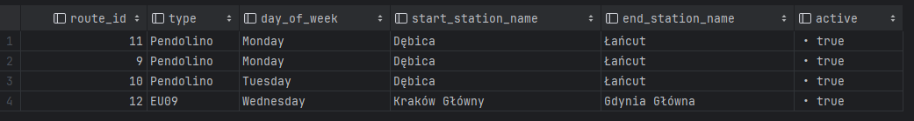
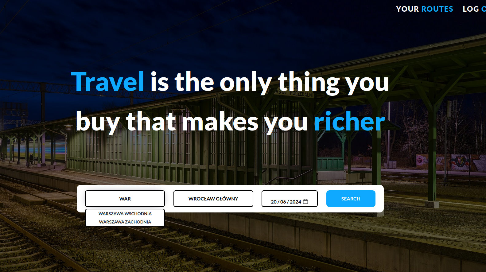
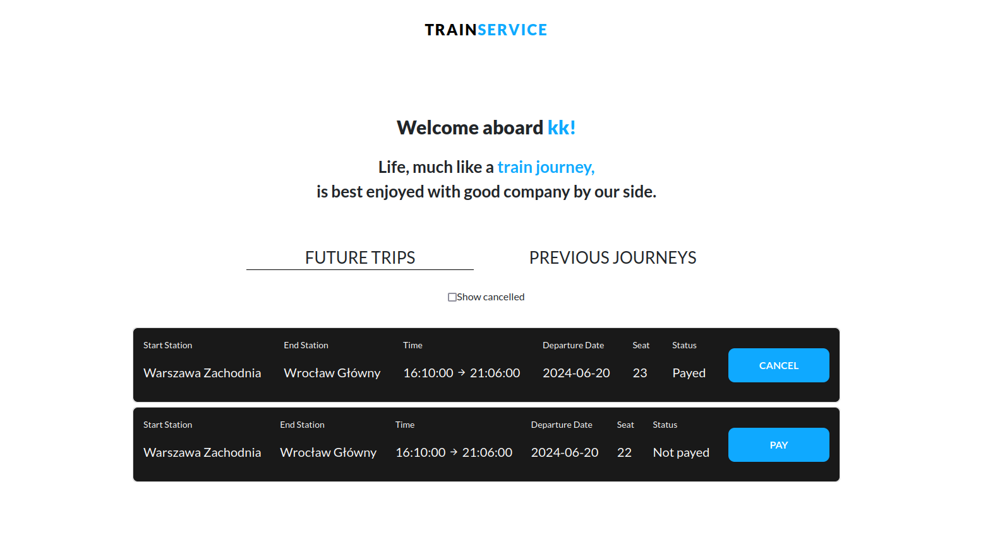
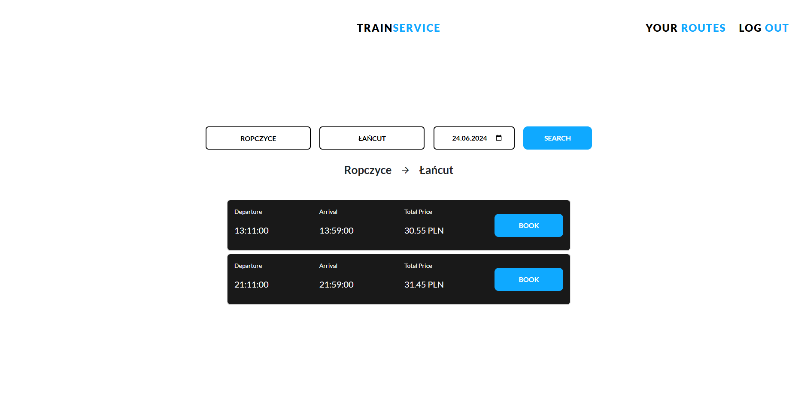
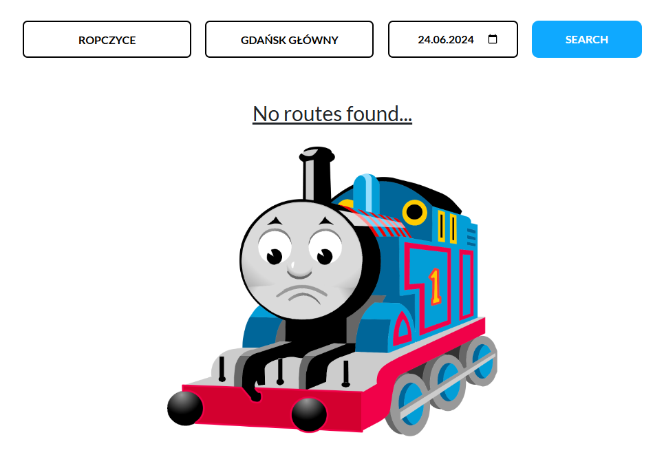
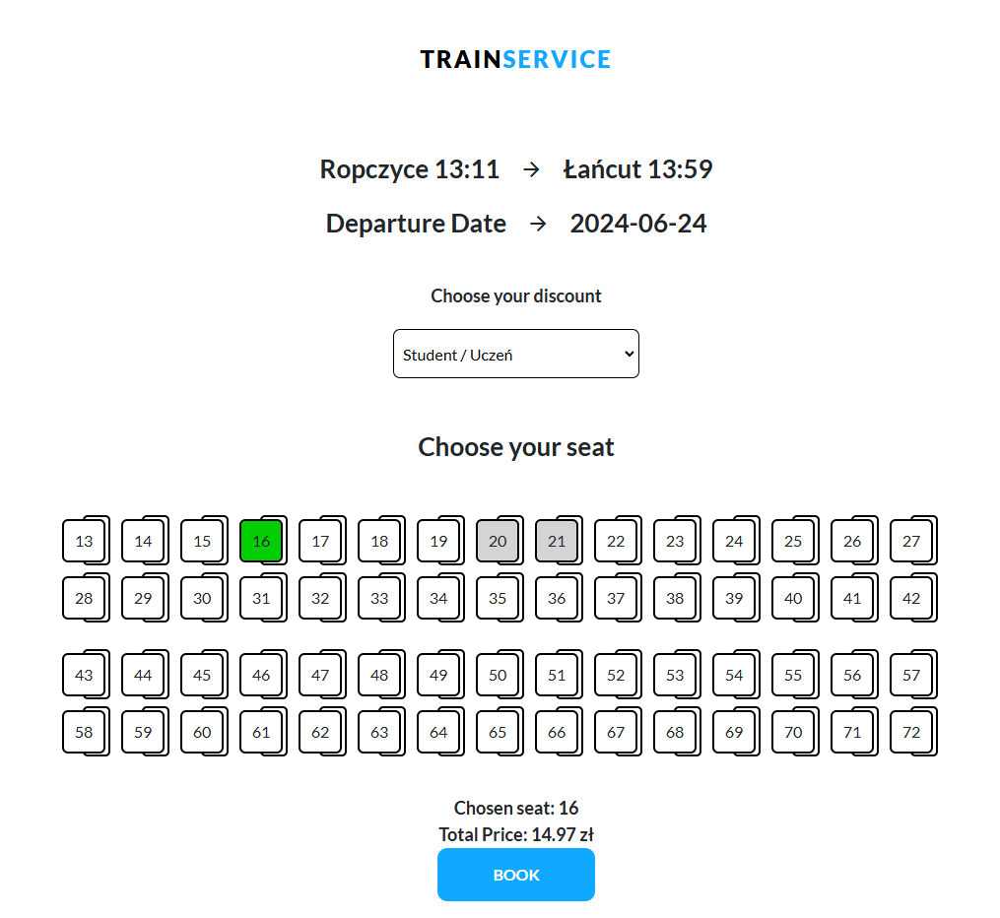
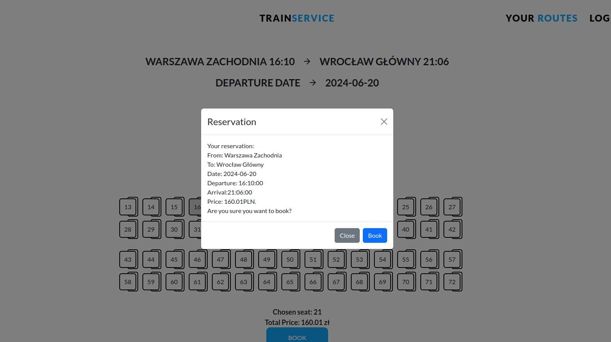
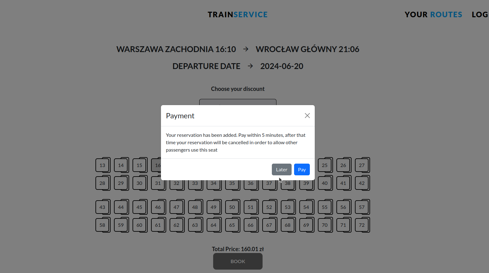

# Sprawozdanie z projektu z przedmiotu Bazy Danych II
<strong>Autorzy</strong>: 

[Kamil Rudny](https://github.com/krudny) <br>
karudny@student.agh.edu.pl <br> 

[Urszula Stankiewicz](https://github.com/ustankie) <br>
ustankiewicz@student.agh.edu.pl <br>

<strong>Temat</strong>: *Platforma obsługująca połączenia kolejowe*  
<strong>Technologie</strong>: PostgreSQL, SpringBoot oraz React.  
<strong>Project Github</strong>: https://github.com/ustankie/Trains

## Spis treści


- [Sprawozdanie z projektu z przedmiotu Bazy Danych II](#sprawozdanie-z-projektu-z-przedmiotu-bazy-danych-ii)
  - [Spis treści](#spis-treści)
  - [Schemat bazy danych](#schemat-bazy-danych)
- [Tabele](#tabele)
  - [Tabela discounts](#tabela-discounts)
  - [Tabela log\_reservation](#tabela-log_reservation)
  - [Tabela reservations](#tabela-reservations)
  - [Tabela route](#tabela-route)
  - [Tabela route\_sections](#tabela-route_sections)
  - [Tabela seat\_reservations](#tabela-seat_reservations)
  - [Tabela seats](#tabela-seats)
  - [Tabela section\_details](#tabela-section_details)
  - [Tabela stations](#tabela-stations)
  - [Tabela trains](#tabela-trains)
  - [Tabela users](#tabela-users)
- [Widoki](#widoki)
  - [Widok all\_routes](#widok-all_routes)
  - [Widok all\_stations](#widok-all_stations)
- [Procedury](#procedury)
  - [add\_train](#add_train)
  - [add\_station](#add_station)
  - [add\_route](#add_route)
  - [add\_user](#add_user)
  - [add\_discount](#add_discount)
  - [add\_seat](#add_seat)
  - [station\_exists](#station_exists)
  - [add\_section\_details](#add_section_details)
  - [add\_section\_details\_both\_ways](#add_section_details_both_ways)
  - [add\_route\_section](#add_route_section)
  - [change\_route\_status](#change_route_status)
  - [add\_reservation](#add_reservation)
  - [update\_user\_password](#update_user_password)
  - [change\_reservation\_status](#change_reservation_status)
- [Funkcje](#funkcje)
  - [find\_routes](#find_routes)
  - [user\_reservations](#user_reservations)
  - [route\_passengers](#route_passengers)
  - [section\_exists](#section_exists)
  - [section\_distance](#section_distance)
  - [get\_station\_id](#get_station_id)
  - [count\_sum\_price](#count_sum_price)
  - [reservation\_sum\_price](#reservation_sum_price)
  - [get\_departure\_time](#get_departure_time)
  - [get\_route\_sections](#get_route_sections)
  - [get\_occupied\_seats](#get_occupied_seats)
  - [get\_last\_log](#get_last_log)
- [Triggery](#triggery)
  - [status\_insert\_trigger](#status_insert_trigger)
- [Backend](#backend)
  - [Konfiguracja](#konfiguracja)
    - [ApplicationConfig](#applicationconfig)
    - [SecurityConfig](#securityconfig)
    - [WebConfig](#webconfig)
  - [Model](#model)
    - [Discout](#discout)
    - [Occupied Seats](#occupied-seats)
    - [Reservations](#reservations)
    - [Route](#route)
    - [Seat](#seat)
    - [Station](#station)
    - [User](#user)
  - [Elementy modelu, których nie przechowujemy w bazie danych](#elementy-modelu-których-nie-przechowujemy-w-bazie-danych)
    - [ReservationHistory](#reservationhistory)
    - [SpecifiedRouteController](#specifiedroutecontroller)
  - [Repository](#repository)
    - [Discount](#discount)
    - [Occupied Seats](#occupied-seats-1)
    - [Reservation](#reservation)
    - [Route](#route-1)
    - [Seat](#seat-1)
    - [Station](#station-1)
    - [User](#user-1)
  - [Service](#service)
    - [Authentication](#authentication)
    - [Discount](#discount-1)
    - [JWT](#jwt)
    - [Occupied Seats](#occupied-seats-2)
    - [Reservation](#reservation-1)
    - [Seat](#seat-2)
    - [Station](#station-2)
  - [Controller](#controller)
    - [Auth](#auth)
    - [Discount](#discount-2)
    - [Occupied Seats](#occupied-seats-3)
    - [Reservation](#reservation-2)
    - [Reservation History](#reservation-history)
    - [Route View](#route-view)
    - [Seat](#seat-3)
    - [Station](#station-3)
  - [Inne klasy](#inne-klasy)
    - [JwtAuthenticationFilter](#jwtauthenticationfilter)
    - [AuthenticationRequest](#authenticationrequest)
    - [AuthenticationResponse](#authenticationresponse)
    - [RegisterRequest](#registerrequest)
    - [ChangeReservationStatus](#changereservationstatus)
- [Frontend](#frontend)
  - [Komunikacja frontu z backendem](#komunikacja-frontu-z-backendem)
  - [Komunikacja aplikacji przy autentykacji użytkowników](#komunikacja-aplikacji-przy-autentykacji-użytkowników)
    - [Zarządzanie tokenami uwierzytelniającymi](#zarządzanie-tokenami-uwierzytelniającymi)
    - [JWT](#jwt-1)
    - [Wysyłanie żądań HTTP](#wysyłanie-żądań-http)
    - [Sprawdzanie ważności tokena](#sprawdzanie-ważności-tokena)
    - [Implementacja](#implementacja)
  - [Hero component](#hero-component)
  - [Login i register](#login-i-register)
  - [User dashboard](#user-dashboard)
  - [Routes display](#routes-display)
  - [Add reservation](#add-reservation)
- [Podsumowanie i wnioski](#podsumowanie-i-wnioski)

## Schemat bazy danych 


# Tabele

## Tabela discounts

Tabela zawiera wszystkie możliwe zniżki na bilety.

`discount_ID` - ID zniżki <br>
`discount_name` - nazwa zniżki <br>
`percent` - procent zniżki <br>

Implementacja:
```sql 
CREATE TABLE discounts (
    discount_ID bigserial  NOT NULL,
    discount_name varchar(30)  NOT NULL,
    percent int  NOT NULL,
    CONSTRAINT discounts_pk PRIMARY KEY (discount_ID)
);
```
## Tabela log_reservation

Tabela zawiera logi zmiany statusu rezerwacji. 

`log_id` - ID logowania rezerwacji <br>
`reservation_id` - ID rezerwacji <br>
`new_status` - nowy status <br>
`date` - data <br>

Implementacja:
```sql
CREATE TABLE log_reservation (
    log_id bigserial  NOT NULL,
    reservation_id bigserial  NOT NULL,
    new_status varchar(10)  NOT NULL,
    date timestamp  NOT NULL,
    CONSTRAINT log_reservation_pk PRIMARY KEY (log_id)
);
```
## Tabela reservations

Tabela zawiera rezerwacje biletów na pociągi. 

`reservation_ID` - ID rezerwacji <br>
`user_ID` - ID użytkownika <br>
`payment_status` - status płatności <br>
`price` - cena <br>
`res_date` - data rezerwacji <br>
`discount_ID` - ID zniżki <br>
`route_ID` - ID trasy <br>
`start_station_id` - ID stacji początkowej <br>
`end_station_id` - ID stacji końcowej <br>
`departure_date` - data wyjazdu <br>

Implementacja:
```sql 
CREATE TABLE reservations (
    reservation_ID bigserial  NOT NULL,
    user_ID bigserial  NOT NULL,
    payment_status varchar(10)  NOT NULL,
    price int  NOT NULL,
    res_date timestamp  NOT NULL,
    discount_ID bigserial  NOT NULL,
    route_ID bigserial  NOT NULL,
    start_station_id bigserial  NOT NULL,
    end_station_id bigserial  NOT NULL,
    departure_date date  NOT NULL,
    CONSTRAINT reservations_pk PRIMARY KEY (reservation_ID)
);
```
## Tabela route

Tabela zawiera ogólne trasy pociagów. 

`route_ID` - ID trasy <br>
`train_ID` - ID pociągu <br>
`day_of_week` - dzień tygodnia <br>
`start_station_ID` - ID stacji początkowej <br>
`end_station_ID` - ID stacji końcowej <br>
`active` - czy trasa jest aktywna <br>

Implementacja:
```sql 
CREATE TABLE route (
    route_ID bigserial  NOT NULL,
    train_ID bigserial  NOT NULL,
    day_of_week varchar(10)  NOT NULL,
    start_station_ID bigserial  NOT NULL,
    end_station_ID bigserial  NOT NULL,
    active boolean  NOT NULL,
    CONSTRAINT route_pk PRIMARY KEY (route_ID)
);
```
## Tabela route_sections

Tabela zawiera dokładne dane dla danej trasy pociągu. 

`route_section_ID` - ID odcinka trasy <br>
`section_id` - ID odcinka <br>
`route_ID` - ID trasy <br>
`departure` - czas odjazdu  <br>
`arrival` - czas przyjazdu <br>
`price` - cena <br>

Implementacja:
```sql 
CREATE TABLE route_sections (
    route_section_ID bigserial  NOT NULL,
    section_id bigserial  NOT NULL,
    route_ID bigserial  NOT NULL,
    departure time  NOT NULL,
    arrival time  NOT NULL,
    price float  NOT NULL,
    CONSTRAINT route_sections_pk PRIMARY KEY (route_section_ID)
);
```
## Tabela seat_reservations

Tabela zawiera rezerwacje miejsca dla konkretnego bileu. 

`seat_res_id` - ID rezerwacji miejsca <br>
`reservation_id` - ID rezerwacji <br>
`seat_id` - ID miejsca <br>
`section_id` - ID odcinka <br>

Implementacja:
```sql 
CREATE TABLE seat_reservations (
    seat_res_id bigserial  NOT NULL,
    reservation_id bigserial  NOT NULL,
    seat_id bigserial  NOT NULL,
    section_id bigserial  NOT NULL
);
```
## Tabela seats

Tabela zawiera dostępne miejsca w pociągach.

`seat_id` - ID miejsca <br>
`class` - klasa <br>

Implementacja:
```sql
CREATE TABLE seats (
    seat_id bigserial  NOT NULL,
    class int  NOT NULL,
    CONSTRAINT seats_pk PRIMARY KEY (seat_id)
);
```

## Tabela section_details

Tabela zawiera odcinki po których jeżdzą pociagi. 

`section_id` - ID sekcji <br>
`start_station_ID` - ID stacji początkowej <br>
`next_station_ID` - ID następnej stacji <br>
`distance` - odległość <br>

Implementacja:
```sql
CREATE TABLE section_details (
    section_id bigserial  NOT NULL,
    start_station_ID bigserial  NOT NULL,
    next_station_ID bigserial  NOT NULL,
    distance float  NOT NULL,
    CONSTRAINT section_details_pk PRIMARY KEY (section_id)
);
```
## Tabela stations

Tabela słownikowa przechowująca wszystkie obsługiwane stacje. 

`station_ID` - ID stacji <br>
`name` - nazwa <br>

Implementacja:
```sql 
CREATE TABLE stations (
    station_ID bigserial  NOT NULL,
    name varchar(50)  NOT NULL,
    CONSTRAINT stations_pk PRIMARY KEY (station_ID)
);
```

## Tabela trains

Tabela przechowuje wszystkie pociągi. 

`train_ID` - ID pociągu <br>
`type` - nazwa pociągu <br>
`capacity` - pojemność <br>

Implementacja:
```sql
CREATE TABLE trains (
    train_ID bigserial  NOT NULL,
    type varchar(30)  NOT NULL,
    capacity int  NOT NULL,
    CONSTRAINT trains_pk PRIMARY KEY (train_ID)
);
```
## Tabela users

Tabela przechowuje dane o użytkownikach. 

`user_ID` - ID użytkownika <br>
`firstname` - imię <br>
`lastname` - nazwisko <br>
`email` - email <br>
`phone` - telefon <br>
`login` - login <br>
`password` - hasło <br>

Implementacja:
```sql
CREATE TABLE users (
    user_ID bigserial  NOT NULL,
    firstname varchar(30)  NOT NULL,
    lastname varchar(30)  NOT NULL,
    email varchar(30)  NOT NULL,
    phone varchar(15)  NOT NULL,
    login varchar(30)  NOT NULL,
    password varchar(30)  NOT NULL,
    CONSTRAINT users_pk PRIMARY KEY (user_ID)
);
```

# Widoki

## Widok all_routes

Widok zawiera informacje o wszystkich trasach pociągu. 

Implementacja: 
```sql
create or replace view public.all_routes (route_id, type, day_of_week, start_station_name, end_station_name, active) as
SELECT route.route_id,
       trains.type,
       route.day_of_week,
       start_station.name AS start_station_name,
       end_station.name   AS end_station_name,
       route.active
FROM route
         JOIN trains ON route.train_id = trains.train_id
         JOIN stations start_station ON route.start_station_id = start_station.station_id
         JOIN stations end_station ON route.end_station_id = end_station.station_id;
```

Przykładowy widok:



## Widok all_stations

Widok zawiera wszystkie możliwe stacje po których poruszają sie pociągi. 

Implementacja: 
```sql
create or replace view public.all_stations(station_id, name) as
SELECT stations.station_id,
       stations.name
FROM stations;
```

Przykładowy widok: 


# Procedury

## add_train

Funkcja przyjmuje nazwę pociagu oraz jego pojemność i dodaje ten pociąg do bazy. 

Implementacja: 
```sql
create or replace procedure public.add_train(IN _type character varying, IN _capacity integer)
    language plpgsql
as
$$
BEGIN
    INSERT INTO trains(type, capacity)
    VALUES (_type, _capacity);
END;
$$;
```

Przykładowe wywołanie:
```sql
CALL add_train('EU09', 40);
```

Wynik: 


## add_station

Funkcja przyjmuje nazwę stacji i dodaje ją do bazy.

Implementacja: 
```sql
create or replace procedure public.add_station(IN _name character varying)
    language plpgsql
as
$$
BEGIN
    IF EXISTS(SELECT 1 FROM stations WHERE name = _name) THEN
        RAISE EXCEPTION 'Such station already exists in database!';
    ELSE
        INSERT INTO stations (name)
        VALUES (_name);
    end if;
END;
$$;
```

Przykładowe wywołanie:
```sql
CALL add_station('Łańcut');
```

Wynik: 


## add_route

Procedura dodaje nową trasę.
Procedura sprawdza 
- czy stacja początkowa i końcowa istnieją
- czy taka trasa już nie jest w bazie

Implementacja: 
```sql
create or replace procedure public.add_route(IN _train_id integer, IN _day_of_week character varying, IN _start_station_name character varying, IN _end_station_name character varying)
    language plpgsql
as
$$
DECLARE
    v_start_station_id INT;
    v_end_station_id INT;
BEGIN
    IF EXISTS(SELECT 1 FROM trains WHERE train_id = _train_id) THEN
        v_start_station_id := get_station_id(_start_station_name);
        IF v_start_station_id IS NULL THEN
            RAISE EXCEPTION 'Start station "%" does not exist!', _start_station_name;
        END IF;

        v_end_station_id := get_station_id(_end_station_name);
        IF v_end_station_id IS NULL THEN
            RAISE EXCEPTION 'End station "%" does not exist!', _end_station_name;
        END IF;

        IF EXISTS(SELECT 1 FROM route
                  WHERE train_id = _train_id
                    AND day_of_week = _day_of_week
                    AND start_station_id = v_start_station_id
                    AND end_station_id = v_end_station_id) THEN
            RAISE EXCEPTION 'Route already exists with these parameters.';
        ELSE
            INSERT INTO route(train_id, day_of_week, start_station_id, end_station_id, active)
            VALUES (_train_id, _day_of_week, v_start_station_id, v_end_station_id, TRUE);
        END IF;
    ELSE
        RAISE EXCEPTION 'There is no train with ID %', _train_id;
    END IF;
END;
$$;
```

Przykładowe wywołanie: 
```sql
CALL add_route(1, 'Monday', 'Ropczyce', 'Łańcut');
```

Wynik: 


## add_user
Dodaje użytkownika o podanych parametrach
```sql
create procedure add_user(IN _firstname character varying, IN _lastname character varying, IN _email character varying, IN _phone character varying, IN _login character varying, IN _password character varying)
    language plpgsql
as
$$
begin

    insert into users(firstname, lastname, email, phone, login, password)
    values (_firstname,_lastname,_email,_phone,_login,_password);

end $$;

```

## add_discount

Dodaje zniżkę o podanej nazwie oraz procencie zniżki
```sql
create procedure add_discount(IN _discount_name character varying, IN _percent integer)
    language plpgsql
as
$$
begin

    insert into discounts(discount_name, percent)
    values (_discount_name,_percent);

end $$;
```

## add_seat

Dodaje miejsce do tabeli seats
```sql
create procedure add_seat(IN _class integer, IN _seat_number integer)
    language plpgsql
as
$$
begin

    insert into seats(class, seat_number)
    values (_class,_seat_number);

end $$;

alter procedure add_seat(integer, integer) owner to ula;


```
## station_exists

Jeśli stacja o danym id nie istnieje, procedura zwraca wyjątek
```sql

CREATE procedure station_exists(_station_id int)
    LANGUAGE plpgsql
AS $$
BEGIN
    if not exists(select * from stations where station_id=_station_id) then
        raise exception 'Station does not exist';
    end if;
END;
$$;
```

## add_section_details

Dodaje szczegóły dla danego odcinka: stację początkową, końcową oraz dystans

```sql
create procedure add_section_details(IN _start_station_id integer, IN _next_station_id integer, IN _distance double precision)
    language plpgsql
as
$$
begin
    call station_exists(_start_station_id);
    call station_exists(_next_station_id);

    if(section_exists(_next_station_id,_start_station_id)
        and section_distance(_next_station_id,_start_station_id)!=_distance) then
        raise exception 'This route section already exists the other way and distances do not match!';

    end if;

    insert into section_details(start_station_id, next_station_id, distance)
    values (_start_station_id, _next_station_id, _distance);

end $$;
```

## add_section_details_both_ways
Dodaje szczegóły dla danego odcinka w obie strony
```sql
create procedure add_section_details_both_ways(IN _start_station_id integer, IN _next_station_id integer, IN _distance double precision)
    language plpgsql
as
$$
begin
    call station_exists(_start_station_id);
    call station_exists(_next_station_id);
    insert into section_details(start_station_id, next_station_id, distance)
    values (_start_station_id, _next_station_id, _distance);


    insert into section_details(start_station_id, next_station_id, distance)
    values (_next_station_id, _start_station_id, _distance);

end $$;
```

## add_route_section

Dodaje odcinek konkretnej trasy do tabeli route_sections

```sql
create procedure add_route_section(IN _section_id integer, IN _route_id integer, IN _departure time without time zone, IN _arrival time without time zone, IN _price double precision)
    language plpgsql
as
$$
begin

    insert into route_sections(section_id, route_id, departure, arrival, price)
    values (_section_id, _route_id , _departure , _arrival,
            _price );

end $$;
```

## change_route_status

Jeżeli trasa jest aktywna, to ją dezaktywuje, w przeciwnym wypadku zmienia jej status na aktywną. 

```sql
create procedure change_route_status(IN _route_id bigint)
    language plpgsql
as
$$
DECLARE
    curr_status boolean;
BEGIN
    IF EXISTS(SELECT * FROM route WHERE route_id = _route_id) THEN

        SELECT active INTO curr_status FROM route WHERE route_id = _route_id;

        IF curr_status IS NOT TRUE THEN
            UPDATE route
            SET active = true
            WHERE route_id = _route_id;
        ELSE
            UPDATE route
            SET active = false
            WHERE route_id = _route_id;
        END IF;
    ELSE
        RAISE EXCEPTION 'Route with ID %, does not exists!', _route_id;
    END IF;
END;
$$;
```

Przykładowe użycie: 
```sql
CALL change_route_status(9);
```

## add_reservation
Procedura dodaje rezerwację dla podanego użytkownika, trasy, zniżki oraz stacji początkowych i końcowych, a także dodaje do tabeli seat_reservations informację o wszystkich odcinkach, na które zarezerwowane jest dane miejsce.
```sql
create procedure add_reservation(IN _user_id bigint, IN _discount_id bigint, IN _route_id bigint, IN _start_station_id bigint, IN _end_station_id bigint, IN _departure_date date, IN _seat_id bigint)
    language plpgsql
as
$$
declare
    t_section BIGINT;
    _reservation_id BIGINT;
BEGIN

    if _departure_date=CURRENT_DATE then
        if get_departure_time(_start_station_id,_route_id)<CURRENT_TIME
            then
            raise exception 'Cannot book a past route!';
        end if;
    end if;

    if _seat_id in (select *
                    from get_occupied_seats(_route_id,_start_station_id,
                                            _end_station_id,_departure_date)) then
        raise exception 'This seat is already occupied!';
    end if;

    INSERT INTO reservations(  user_id, payment_status, price, res_date, discount_id, route_id, start_station_id, end_station_id, departure_date)
    VALUES (_user_id,DEFAULT,
            count_sum_price(_discount_id,_route_id,
                            _start_station_id,_end_station_id),
            current_timestamp, _discount_id, _route_id, _start_station_id, _end_station_id, _departure_date)
    RETURNING reservation_id INTO _reservation_id;


    FOR t_section IN  (select * from get_route_sections(_route_id, _start_station_id,
                                                  _end_station_id))
    LOOP
            RAISE NOTICE 'Hello, world!';
            INSERT INTO seat_reservations(reservation_id, seat_id, section_id)
            values (_reservation_id,_seat_id,t_section);
    end loop;

END;
$$;
```

## update_user_password

Procedura przyjmuje login i nowe hasło użytkownika i jeżeli użytkownik istnieje to zmienia jego hasło.

Implementacja: 
```sql
create or replace procedure update_user_password(_login varchar(30), _new_password varchar(30))
language plpgsql
as
$$
BEGIN
    IF EXISTS(SELECT * FROM users WHERE login = _login) THEN
        UPDATE users
        SET password = _new_password
        WHERE login = _login;
    ELSE
        RAISE EXCEPTION 'User with login % does not exists', _login;
    end if;
end;
$$;
```

Przykładowe użycie: 

```sql
CALL update_user_password('alicesmith', 'alamakota124');
```
## change_reservation_status
Procedura zmienia status rezerwacji - możliwe są wszystkie zmiany za wyjątkie C -> N oraz P -> N 
```sql
create procedure change_reservation_status(IN _reservation_id integer, IN _status character varying)
    language plpgsql
as
$$
declare
      old_status varchar(10);
begin
    if not exists (select * from reservations where reservation_id=_reservation_id) then
        RAISE EXCEPTION 'Reservation with ID %, does not exist!', _reservation_id;
    end if;

    select payment_status from reservations where reservation_id=_reservation_id into old_status;

    if _status=old_status then
        raise exception 'Statuses are the same!';
    end if;

    if _status='N' then
        raise exception 'Change to not paid is not allowed!';
    end if;
    
    if old_status='C' then
        raise exception 'Change from cancelled is not allowed!';
    end if;

    update reservations
    set payment_status=_status
    where _reservation_id=reservation_id;


end;
$$;
```


# Funkcje

## find_routes

Implementacja: 
```sql
create function find_routes(_departure_date date, _start_station_id bigint, _end_station_id bigint)
    returns TABLE(route_id bigint, departure_day character varying, departure_date date, departure_time time without time zone, arrival_time time without time zone, price double precision)
    language plpgsql
as
$$
DECLARE
    _day varchar(10);
    _discount BIGINT;
BEGIN


    SELECT to_char(_departure_date, 'Day') INTO _day;

    CREATE TEMP TABLE starts ON COMMIT DROP AS (
        SELECT route.route_id, section_details.start_station_id, next_station_id, day_of_week
        FROM route_sections
        INNER JOIN section_details ON route_sections.section_id = section_details.section_id
        INNER JOIN route ON route_sections.route_id = route.route_id
        WHERE section_details.start_station_id = _start_station_id AND trim(day_of_week) = trim(_day)
    );

    CREATE TEMP TABLE ends ON COMMIT DROP AS (
        SELECT route.route_id, section_details.start_station_id, next_station_id, day_of_week, arrival
        FROM route_sections
        INNER JOIN section_details ON route_sections.section_id = section_details.section_id
        INNER JOIN route ON route_sections.route_id = route.route_id
        WHERE section_details.next_station_id = _end_station_id AND trim(day_of_week) = trim(_day)
    );

    select discount_id into _discount
    from discounts where percent=0;

    RETURN QUERY (
        SELECT starts.route_id, starts.day_of_week, _departure_date, route_sections.departure, ends.arrival,
               count_sum_price(_discount, starts.route_id, _start_station_id, _end_station_id)
        FROM starts
        INNER JOIN ends ON starts.route_id = ends.route_id
        INNER JOIN route_sections ON route_sections.route_id = starts.route_id
        INNER JOIN section_details ON route_sections.section_id = section_details.section_id
        WHERE trim(starts.day_of_week) = trim(ends.day_of_week) AND section_details.start_station_id = _start_station_id 
          AND route_sections.departure<=ends.arrival
        order by route_sections.departure
    );

END;
$$;
```

Przykładowe użycie: 
```sql
SELECT * FROM find_routes('2024-05-06', 'Dębica', 'Rzeszów Główny');
```

Wynik zapytania: 


## user_reservations 

Funkcja zwraca wszystkie rezerwacje użytkownika 

Implementacja: 
```sql
create function user_reservations(_user_id integer)
    returns TABLE(reservationid bigint, reservationdate timestamp, routeid bigint, departure time without time zone, arrival time without time zone, startstation character varying, endstation character varying, seatid integer, departuredate date, status character varying)
        language plpgsql
as
$$
begin


    return query (SELECT distinct r.reservation_id,r.res_date,
                                  r.route_id,
                                  (select rs.departure
                                   from section_details sd
                                            inner join route_sections rs on rs.section_id = sd.section_id
                                   where sd.start_station_id = r.start_station_id
                                     and rs.route_id = r.route_id) as departure,
                                  (select rs.arrival
                                   from section_details sd
                                            inner join route_sections rs on rs.section_id = sd.section_id
                                   where sd.next_station_id = r.end_station_id
                                     and rs.route_id = r.route_id) as arrival,
                                  (select name from stations where station_id=r.start_station_id) as start_station,
                                  (select name from stations where station_id=r.end_station_id) as end_station,
                                  (select s.seat_number from seats s where s.seat_id = sr.seat_id) as seat_id,
                                  r.departure_date,
                                  r.payment_status as status
                  FROM reservations r
                           inner JOIN seat_reservations sr ON r.reservation_id = sr.reservation_id

                  WHERE r.user_id = _user_id);
end;
$$;
```

Przykładowe użycie: 
```sql
SELECT * FROM user_reservations(15);
```

## route_passengers

Dla konkretnej trasy danego dnia, funkcja zwraca dane wszystkich pasażerów. 

Implementacja: 
```sql
create or replace function route_passengers(_route_id int, _departure_date date)
returns table(reservation_id bigint, seat_id int, class int, firstname varchar(30), lastname varchar(30))
language plpgsql
as
$$
BEGIN
    RETURN QUERY(SELECT DISTINCT reservations.reservation_id, seats.seat_number, seats.class, users.firstname, users.lastname
    FROM reservations
    INNER JOIN users ON reservations.user_id = users.user_id
    INNER JOIN seat_reservations ON reservations.reservation_id = seat_reservations.reservation_id
    INNER JOIN seats ON seat_reservations.seat_id = seats.seat_id
    WHERE reservations.route_id = _route_id and departure_date = _departure_date);
end;
$$;
```
Przykładowe wywołanie: 
```sql
SELECT * FROM route_passengers(9, '2024-05-05');
```
## section_exists
Jeśli dany odcinek istnieje w section_details, zwraca true, w przeciwnym wypadku false

```sql
create function section_exists(_start_station_id integer, _next_station_id integer) returns boolean
    language plpgsql
as
$$
BEGIN
    if  exists(select * from section_details where start_station_id=_start_station_id and next_station_id=_next_station_id) then
        return true;
    end if;
    return false;
END;
$$;

```

## section_distance

Zwraca dystans na danym odcinku
```sql

create function section_distance(_start_station_id integer, _next_station_id integer) returns double precision
    language plpgsql
as
$$
DECLARE
    distance_value DOUBLE PRECISION;
BEGIN
    SELECT distance INTO distance_value
    FROM section_details
    WHERE start_station_id = _start_station_id AND next_station_id = _next_station_id;

    RETURN distance_value;
END;
$$;


```

## get_station_id

Funkcja przyjmuje nazwę stacji i zwraca ID stacji, w przypadku braku stacji zwraca null. 

Implementacja:

```sql
create function get_station_id(_name character varying) returns integer
    language plpgsql
as
$$
DECLARE result INT;
BEGIN
    SELECT stations.station_id INTO result
    FROM stations
    WHERE _name = stations.name;

    RETURN result;
    EXCEPTION WHEN NO_DATA_FOUND THEN
    RETURN NULL;
end;
$$;
```

Przykładowe wywołanie:
```sql
SELECT get_station_id('Rzeszów Główny');
```

Wynik: 


## count_sum_price

Wylicza sumaryczną cenę za podróż daną trasą od stacji A do B, uwzględniając zniżkę

```sql
create function count_sum_price(_discount_id bigint, _route_id bigint, _start_station_id bigint, _end_station_id bigint) returns double precision
    language plpgsql
as
$$
    declare
        sum_price double precision;
        curr_start BIGINT;
        curr_end BIGINT;
        discount_value double precision;
begin
    if _end_station_id=_start_station_id then
        raise exception 'Same stations! Go on foot!';
    end if;


    curr_start:=_start_station_id;


    CREATE TEMP TABLE temp_route_sections (
                                              route_section_id BIGINT,
                                              start_station_id BIGINT,
                                              next_station_id BIGINT,
                                              price double precision
    );

    INSERT INTO temp_route_sections (route_section_id, start_station_id, next_station_id, price)
    SELECT rs.route_section_id, start_station_id, next_station_id, price
    FROM route_sections rs
    JOIN section_details sd ON rs.section_id = sd.section_id
    WHERE rs.route_id = _route_id ;

    select next_station_id into curr_end
    from temp_route_sections
    where start_station_id=curr_start;

    sum_price=0;

    while curr_end!=_end_station_id loop
            sum_price=sum_price + (SELECT price from temp_route_sections where start_station_id=curr_start);
            raise notice '% % % %', curr_start, curr_end,sum_price, _end_station_id;
            curr_start:=curr_end;
            

            select next_station_id into curr_end
            from temp_route_sections
            where start_station_id=curr_start;

            if curr_end=NULL then
                raise exception 'Cannot find direct route!';
            end if;
    end loop;
    sum_price=sum_price + (SELECT price from temp_route_sections where start_station_id=curr_start);
    drop table temp_route_sections;

    select percent into discount_value
    from discounts
    where discount_id=_discount_id;

    if discount_value=NULL then
        raise exception 'No such discount!';
    end if;

    return ROUND((((100-discount_value)*sum_price)/100)::numeric,2);
    end;

$$;


```

## reservation_sum_price
Zwraca sumaryczną cenę dla danej rezerwacji
```sql
create or replace function reservation_sum_price(_reservation_id bigint) returns double precision
    language plpgsql
as
$$
declare
    _discount_id bigint;
    _route_id bigint;
    _start_station_id bigint;
    _end_station_id bigint;
begin
    select discount_id, route_id, start_station_id, end_station_id into _discount_id, _route_id, _start_station_id
        ,_end_station_id from reservations where reservation_id=_reservation_id;
    return count_sum_price(_discount_id,_route_id,_start_station_id,_end_station_id);
end;
$$;
```

## get_departure_time
Zwraca czas odjazdu pociągu o danej trasie z danej stacji
```sql
create function get_departure_time(_start_station_id bigint, _route_id bigint) returns time without time zone
    language plpgsql
as
$$
declare
    _departure time;
begin
    select departure into _departure
    from route_sections join section_details
    on route_sections.section_id = section_details.section_id
    where _start_station_id=start_station_id and route_id=_route_id;

    return _departure;
end;$$;

alter function get_departure_time(bigint, bigint) owner to ula;


```

## get_route_sections
Zwraca tabelę zawierającą id wszystkich odcinków na trasie od stacji A do B
```sql
create function get_route_sections(_route_id bigint, _start_station_id bigint, _end_station_id bigint)
    returns TABLE(section_id bigint)
    language plpgsql
as
$$
declare
    curr_start BIGINT;
    curr_end BIGINT;
    temp_section BIGINT;
begin
    CREATE TEMP TABLE temp_route_sections (
                                              route_section_id BIGINT,
                                              start_station_id BIGINT,
                                              next_station_id BIGINT
    );

    DROP TABLE IF EXISTS temp_sections;

    CREATE TEMP TABLE temp_sections (
                                             r_section_id BIGINT

    );

    INSERT INTO temp_route_sections (route_section_id, start_station_id, next_station_id)
    SELECT rs.section_id, start_station_id, next_station_id
    FROM route_sections rs
    JOIN section_details sd ON rs.section_id = sd.section_id
    WHERE rs.route_id = _route_id;


    curr_start=_start_station_id;
    select next_station_id into curr_end
    from temp_route_sections
    where start_station_id=curr_start;


    while curr_end<=_end_station_id loop
            select route_section_id into temp_section
           from temp_route_sections
           where start_station_id=curr_start and next_station_id=curr_end;


            insert into temp_sections(r_section_id)
            values (temp_section);

            curr_start=curr_end;

            select next_station_id into curr_end
            from temp_route_sections
            where start_station_id=curr_start;

            if curr_end=NULL then
                raise exception 'Cannot find direct route!';
            end if;
        end loop;
    drop table temp_route_sections;


    RETURN QUERY SELECT r_section_id FROM temp_sections;
end$$;

```

## get_occupied_seats
Zwraca tabelę zawierającą wszystkie seat_id siedzeń, które są zarezerwowane (ale rezerwacja nie jest anulowana) na którymkolwiek odcinku pomiędzy start_station i end_station na danej trasie danego dnia
```sql
create function get_occupied_seats(_route_id bigint, _start_station_id bigint, _end_station_id bigint, _date date)
    returns TABLE(seat_id bigint)
    language plpgsql
as
$$
begin
    return query (select sr.seat_id
        from seat_reservations sr join reservations r
        on r.reservation_id=sr.reservation_id
        where
            departure_date=_date and
            payment_status!='C' and
            section_id in (select * from get_route_sections(_route_id,_start_station_id ,_end_station_id)));
end$$;
```

## get_last_log
Zwraca ostatni log z tabeli log_reservations dla rezerwacji o podanym id:
```sql
create function get_last_log(_reservation_id integer)
    returns TABLE(log_id bigint, reservation_id bigint, new_status character varying, date timestamp without time zone)
    language plpgsql
as
$$
begin
    return query(select * from log_reservation lr where lr.reservation_id=_reservation_id order by date desc limit 1);


end;
$$;
```

# Triggery

## status_insert_trigger

Wprowadza wpis do tabeli reservation_logs, kiedy zostanie dodany rekord do tabeli reservations:
```sql
create function log_status_insert() returns trigger
    language plpgsql
as
$$
BEGIN
    IF TG_OP = 'INSERT' or TG_OP = 'UPDATE' THEN
        INSERT INTO log_reservation (reservation_id, new_status, date)
        VALUES (NEW.reservation_id, NEW.payment_status, timezone('Europe/Warsaw', CURRENT_TIMESTAMP));
    END IF;
    RETURN NEW;
END;
$$;


CREATE TRIGGER status_insert_trigger
    AFTER INSERT ON reservations
    FOR EACH ROW
EXECUTE FUNCTION log_status_insert();
```

# Backend 

## Konfiguracja
Spring wymaga określenia w konfiguracji m.in. tzw. Bean'ów, czyli klas, którymi będzie automatycznie administrował. Stworzyliśmy kilka klas, które odpowiadają za różne aspekty konfiguracji:
### ApplicationConfig
Klasa określa serwis administrujący użytkownikami, AuthenticationProvider, który jest częścią Spring Security i służy do uwierzytelniania użytkowników, AuthenticationManager, encoder haseł oraz pulę wątków, która pozwoli nam tworzyć nowy wątek, który będzie działał równolegle do aplikacji i pozwoli nam np. zaplanować zmianę statusu rezerwacji na "cancelled" po określonym czasie.

```java
@Configuration
@RequiredArgsConstructor
public class ApplicationConfig {

    private final UserRepository repository;

    @Bean
    public UserDetailsService userDetailsService() {
        return username -> repository.findByLogin(username).orElseThrow(() -> new UsernameNotFoundException("User not found"));
    }

    @Bean
    public AuthenticationProvider authenticationProvider(){
        DaoAuthenticationProvider authProvider=new DaoAuthenticationProvider();
        authProvider.setUserDetailsService(userDetailsService());
        authProvider.setPasswordEncoder(passwordEncoder());

        return authProvider;
    }

    @Bean
    public AuthenticationManager authenticationManager(AuthenticationConfiguration config) throws Exception {
        return config.getAuthenticationManager();

    }

    @Bean
    public PasswordEncoder passwordEncoder(){
        return new BCryptPasswordEncoder();
    }

    @Bean
    public ScheduledExecutorService scheduledExecutorService() {
        return Executors.newScheduledThreadPool(1);
    }
}
```

###  SecurityConfig
Konfiguracja komponentów związanych z bezpieczeństwem systemu. W securityFilterChain określamy np. strony, które będą dostępne bez konieczności logowania się do systemu - wszystkie inne będą niedostępne dla niezalogowanych użytkowników.
```java
@Configuration
@EnableWebSecurity
@RequiredArgsConstructor
public class SecurityConfig {
    private final JwtAuthenticationFilter jwtAuthFilter;
    private final AuthenticationProvider authenticationProvider;


    @Bean
    public SecurityFilterChain securityFilterChain(HttpSecurity http) throws Exception {
        http .csrf(AbstractHttpConfigurer::disable)
                .authorizeHttpRequests(auth -> auth
                        .requestMatchers("/api/auth/**","/api/getOccupiedSeats","/api/find_route", "/", "/api/stations").permitAll() // Define public endpoints here
                        .anyRequest().authenticated()
                )
                .sessionManagement(session -> session
                        .sessionCreationPolicy(SessionCreationPolicy.STATELESS)
                )
                .authenticationProvider(authenticationProvider)
                .addFilterBefore(jwtAuthFilter, UsernamePasswordAuthenticationFilter.class);

        return http.build();
    }
}
```
### WebConfig
Określa, jaka jest domyślna ścieżka mapowania requestów HTTP, z jakiego portu dozwolona jest komunikacja z backendem oraz jakie operacje CRUD dopuszczamy.

```java
@Configuration
public class WebConfig implements WebMvcConfigurer {
    @Override
    public void addCorsMappings(CorsRegistry registry) {
        registry.addMapping("/**")
                .allowedOrigins("http://localhost:5173")
                .allowedMethods("GET", "POST", "PUT", "DELETE", "OPTIONS")
                .allowedHeaders("*");
    }
}
```

## Model 

Aby reprezentować bazę w modelu obiektowym stworzyliśmy klasy z odpowiadającymi im atrybutami do kolumn w bazie.

### Discout
Odpowiada tabeli discounts w bazie (adnotacja @Table). Można tu też zaobserwować adnotację @Getter, która automatycznie dodaje gettery wszystkich atrybutów oraz @Entity - oznacza, że obiekt będzie miał swoje odwzorowanie w bazie danych. Ponadto, jeżeli klasa @Entity nie posiada atrybutu o nazwie id, należy dodać adnotację @Id nad atrybutem, który spełnia rolę klucza głównego w bazie danych.

```java
@Getter
@Entity
@Table(name="discounts")
public class Discount {
    @Id
    private Long discountId;
    private String discountName;
    private Integer percent;
}
```

### Occupied Seats 
Odpowiada tabeli occupied_seats
```java
@Getter
@Entity
@Table(name="occupied_seats")
public class OccupiedSeats {
    @Id
    private Long seatId;
}
```

### Reservations
Odpowiada tabeli Reservations
```java
@Getter
@Entity
@Table(name="reservations")
public class Reservation {
    @Id
    private Long reservationId;
    private Long userId;
    private Long discountId;
    private Long routeId;
    private String startStation;
    private String endStation;
    private LocalDate departureDate;
    private Long seatId;

    public void setReservationId(Long reservationId) {
        this.reservationId = reservationId;
    }
}
```

### Route
Odpowiada tabeli Route. Modyfikator `transient` oznacza, że start_station_name oraz end_station_name nie będą przechowywane w bazie (takie kolumny w tabeli route nie istnieją). Te atrybuty są nam potrzebne tylko w modelu obiektowym.
```java
@Getter
@Setter
@Entity
@Table(name="route")
public class Route {
    @Id
    private Long routeId;
    private Long trainId;
    private boolean active;
    private String day_of_week;
    private transient String start_station_name;
    private transient String end_station_name;
}
```

### Seat
Odpowiada tabeli seats
```java
@Getter
@Entity
@Table(name="seats")
public class Seat {
    @Id
    private Long seatId;
    private Integer seatClass;
    private Integer seatNumber;
}
```

### Station
Odpowiada tabeli stations.
```java
@Entity
@Table(name = "stations")
@Getter
@Setter
public class Station {
    @Id
    private Long id;

    @Column(name = "name")
    private String name;
}
```

### User
Odpowiada tabeli users. Implementuje interfejs UserDetails, który jest częścią Spring Security. Warto zwrócić uwagę na adnotacje:
- @Data - adnotacja z biblioteki Lombok, automatycznie generuje funkcje toString(), equals(), hashCode(), a także gettery i settery wszystkich atrybutów oraz konstruktor zawierający jako argumenty wszystkie atrybuty z modyfikatorem final. Tak naprawdę łączy w sobie adnotacje @Getter, @Setter, @ToString, @EqualsAndHashCode, @RequiredArgsConstructor
- @NoArgsConstructor - generuje konstruktor bezargumentowy
- @AllArgsConstructor - generuje konstruktor dla wszystkich atrybutów
- @Builder - generuje implementację wzorca projektowego "Budowniczy" dla klasy - dostarcza metod pozwalających ustawić konkretne atrybuty na żądane wartości oraz metodę build(). Przyda się to później (klasa AuthenticationService), kiedy będziemy chcieli np. zarejestrować nowego użytkownika o podanych danych. 

Wprowadzamy też role dla użytkownika w postaci klasy Enum Role - na razie nasza aplikacja korzysta tylko z roli USER, ale daje nam to możliwość rozwoju w przyszłości (np. role ADMIN, MODIFIER). Kontrolę nad możliwymi wartościami atrybutu role uzyskujemy poprzez adnotację @Enumerated.
```java
@Data
@Builder
@NoArgsConstructor
@AllArgsConstructor
@Entity
@Table(name="users")
public class User implements UserDetails {

    @Id
    @GeneratedValue(strategy = GenerationType.SEQUENCE, generator = "users_user_id_seq")
    @SequenceGenerator(name = "users_user_id_seq", sequenceName = "users_user_id_seq", allocationSize = 1)
    private Long userId;
    private String firstname;
    private String lastname;
    private String email;
    private String phone;
    private String login;
    private String password;

    @Enumerated(EnumType.STRING)
    private Role role;

    @Override
    public Collection<? extends GrantedAuthority> getAuthorities() {
        return List.of(new SimpleGrantedAuthority(role.name()));
    }

    @Override
    public String getUsername() {
        return login;
    }

    @Override
    public String getPassword() {
        return password;
    }

    @Override
    public boolean isAccountNonExpired() {
        return true;
    }

    @Override
    public boolean isAccountNonLocked() {
        return true;
    }

    @Override
    public boolean isCredentialsNonExpired() {
        return true;
    }

    @Override
    public boolean isEnabled() {
        return true;
    }
}
```

Enum Role wygląda następująco:
```java
public enum Role {
    ADMIN,
    USER
}
```
## Elementy modelu, których nie przechowujemy w bazie danych
Poniżej prezentujemy klasy modelu, które służą jedynie projekcji (Projection) danych z bazy, ale nie znajdują odwzorowania w tabelach w PostgreSQL. Korzystamy z nich tylko jako typy zwracane z metod repozytorium.
### ReservationHistory
Interfejs, który zwraca dane o rezerwacji - użyjemy go w RepositoryReservation do zwracania listy wszystkich rezerwacji użytkownika. Tutaj nie wystarczyłoby użycie klasy Reservation, ponieważ dane zawarte w ReservationHistory pochodzą z wielu tabel bazy danych.
```java
public interface ReservationHistory {

    Long getReservationId();
    String getStatus();
    LocalDateTime getReservationDate();
    Long getRouteId();

    LocalTime getDeparture();

    LocalTime getArrival();

    String getStartStation();

    String getEndStation();

    Long getSeatId();

    LocalDate getDepartureDate();

}
```

### SpecifiedRouteController
Podobną sytuację mamy dla danych konkretnej trasy, które wyciągamy z kilku tabel
```java
public interface SpecifiedRouteView {
    Long getRouteId();
    void setRouteId(Long routeId);
    String getDepartureDay();
    void setDepartureDay(String departureDay);
    LocalDate getDepartureDate();
    void setDepartureDate(LocalDate departureDate);
    LocalTime getDepartureTime();
    void setDepartureTime(LocalTime departureTime);
    LocalTime getArrivalTime();

    void setArrivalTime(LocalTime arrivalTime);

    Double getPrice();
}
```

## Repository

Warstwa repozytorium obłsuguje połączenie backendu z bazą danych. Z repozytorium są wykonywane zapytania oraz podstawowe operacje CRUD. Nasze repozytoria implementują interfejs JpaRepository. Dostarcza nam to gotowych mechanizmów służących do pracy z operacjami CRUD (np. save(S entity) - zapisuje encję w bazie danych, findAll() - zwraca wszystkie encje, findById(Id id) - znajduje wynik po id). Natomiast adnotacja @Repository jest adnotacją Spring, która czyni klasę bean'em - umożliwia to automatyczne wstrzykiwanie zależności przez mechanizmy framework'a oraz tłumaczy wyjatki otrzymywane z bazy na wyjątki Springa. 
Korzystaliśmy też z adnotacji @Query, która pozwala na zapisanie zapytania w czystym SQL (u nas PostgreSQL) nad konkretną metodą. Metoda ta będzie odpowiadać wykonaniu zapytania z @Query w bazie i będzie zwracać jego ewentualne wyniki w postaci obiektów modelu obiektowego.

### Discount 
Repozytorium dla wszystkich zniżek, posiada jedną metodę, która zwraca wszystkie zniżki z bazy.
```java
@Repository
public interface DiscountRepository extends JpaRepository<Discount, Long> {
    @Query(value = "SELECT * FROM discounts", nativeQuery = true)
    List<Discount> findAllDiscounts();
}
```

### Occupied Seats
Repozytorium dla OccupiedSeats, posiada metodę getOccupiedSeats, która dla przyjętych parametrów wywołuje funkcję PostgreSQL get_occupied_seats i zwraca jej wynik w postaci listy obiektów klasy OccupiedSeats.
```java
@Repository
public interface OccupiedSeatsRepository extends JpaRepository<OccupiedSeats, Long> {
    @Query(value = "SELECT * FROM get_occupied_seats(:_route_id, :_start_station_id, :_end_station_id, :_date)", nativeQuery = true)
    List<OccupiedSeats> getOccupiedSeats(
            @Param("_route_id") Long routeId,
            @Param("_start_station_id") Long startStationId,
            @Param("_end_station_id") Long endStationId,
            @Param("_date") LocalDate date
    );
}
```

### Reservation
Repozytorium dla wszystkich rezerwacji. Posiada metody:
- callAddReservation - wywołuje funkcję add_reservation z bazy i zwraca jej wynik w postaci zmiennej typu Integer
- getStationId - wywołuje funkcję get_station_id z bazy i zwraca wynik w postaci zmiennej typu Long
- getAllTrips - wywołuje funkcję user_reservations z bazy i zwraca wynik w postaci listy obiektów klasy ReservationHistory 
- changeStatus - dla podanych parametrów wywołuje procedurę change_reservation_status z bazy (adnotacja @Procedure skraca zapis z @Query)
- getSumPrice - zwraca sumaryczną cenę rezerwacji o podanym id (wynik wywołania funkcji reservation_sum_price z bazy)
- findAllByPaymentStatus - zwraca wszystkie rezerwacje o podanym statusie, które zostały dodane do bazy wcześniej niż przed pięcioma minutami
```java
public interface ReservationRepository extends JpaRepository<Reservation, Long> {
    @Transactional
    @Query(nativeQuery = true, value = "SELECT * from add_reservation(:_user_id, :_discount_id, :_route_id, :_start_station_id, :_end_station_id, :_departure_date, :_seat_id)")

    Integer callAddReservation(@Param("_user_id") Long userId, @Param("_discount_id") Long discountId, @Param("_route_id") Long routeId, @Param("_start_station_id") Long startStationId, @Param("_end_station_id") Long endStationId, @Param("_departure_date") LocalDate departureDate, @Param("_seat_id") Long seatId);

    @Query(nativeQuery = true, value = "SELECT get_station_id(:_name)")
    Long getStationId(@Param("_name") String stationName);

    @Query(nativeQuery = true, value = "SELECT *" + "from user_reservations(:_user_id) as all_trips")
    List<ReservationHistory> getAllTrips(@Param("_user_id") Integer user_id);

    @Procedure("change_reservation_status")
    void changeStatus(@Param("_reservation_id") Long reservation_id, @Param("_status") String status);

    @Query(nativeQuery = true, value = "SELECT *" + "from reservation_sum_price(:_reservation_id)")
    Double getSumPrice(@Param("_reservation_id") Long reservation_id);

    @Query(nativeQuery = true, value = "SELECT *" + "from reservations where payment_status=?1 and EXTRACT(EPOCH FROM (CAST(?2 AS timestamp) - res_date))/60  > 5")
    List<Reservation> findAllByPaymentStatus(String paymentStatus, LocalDateTime time);

}
```

### Route
Repozytorium dla wszystkich tras. Metoda getStationId zwraca id stacji o podanej nazwie jako wynik wywołania funkcji get_station_id z bazy, a metoda getSpecifiedRoute zwraca wynik wykonania funkcji find_routes z bazy jako listę obiektów klasy SpecifiedRouteView.

```java
@Repository
public interface RouteRepository extends JpaRepository<Route, Long> {

    @Query(nativeQuery = true, value = "SELECT get_station_id(:name)")
    Long getStationId(@Param("name") String name);

    @Query(nativeQuery = true, value = """
    SELECT 
        route_id as routeId, 
        departure_day as departureDay, 
        departure_date as departureDate, 
        departure_time as departureTime, 
        arrival_time as arrivalTime, 
        price
    FROM 
        find_routes(:_departure_date, :_start_station_id, :_end_station_id) AS route
    """)  

    List<SpecifiedRouteView> getSpecifiedRoute(@Param("_departure_date") LocalDate departure_date,
                                               @Param("_start_station_id") Long start_station_id,
                                               @Param("_end_station_id") Long end_station_id);

}
```

### Seat
Repozytorium dla wszystkich miejsc w pociągu - posiada jedynie metodę zwracającą wszystkie miejsca.
```java
@Repository
public interface SeatRepository extends JpaRepository<Seat, Long> {
    @Query(value = "SELECT * FROM seats", nativeQuery = true)
    List<Seat> findAllSeats();
}
```

### Station
Repozytorium stacji, posiada dwie metody:
- findAllStationNames - zwraca nazwy wszystkich stacji w bazie
- getStationId - zwraca wynik funkcji get_station_id z bazy 
```java
@Repository
public interface StationRepository extends JpaRepository<Station, Long> {
    @Query(value = "SELECT name FROM stations", nativeQuery = true)
    List<String> findAllStationNames();

    @Query(value = "SELECT get_station_id(:stationName)", nativeQuery = true)
    Long getStationId(@Param("stationName") String stationName);
}
```

### User
Repozytorium użytkowników, posiada jedną metodę: 
- findByLogin - zwraca użytkownika o podanym loginie
```java
public interface UserRepository extends JpaRepository <User, Integer>{
    Optional<User> findByLogin(String login);
}
```


## Service 
Warstwa serwisów w aplikacjach Spring ma za zadanie oddzielić logikę biznesową od operacji CRUD. Czasami dane pobrane z repozytorium wymagają jeszcze obróbki przed zwróceniem ich jako response. Właśnie tym powinny zająć się klasy @Service. Pozwala to też na hermetyzację dostępu do repozytoriów oraz pozwala na wielokrotne wykorzystanie tej samej logiki biznesowej.
### Authentication
Klasa odpowiada za zarządzanie rejestracją użytkowników oraz ich uwierzytelnianiem. Posiada metody:
- register - tworzy danego parametrami zapytania użytkownika za pomocą dostarczonego w klasie User mechanizmu @Builder, następnie tworzy token JWT dla tego użytkownika, koduje jego hasło za pomocą obiektu klasy PasswordEncoder dostarczonego z biblioteką Spring Security i zapisuje go w bazie danych
- authenticate - uwierzytelnia istniejącego użytkownika - znajduje go po loginie w bazie, sprawdza zgodność jego loginu i hasła, a następnie generuje token JWT dla niego
- getCurrentUser - zwraca login aktualnie zalogowanego użytkownika lub null, gdy żaden użytkownik nie jest zalogowany
```java
@Service
@RequiredArgsConstructor
public class AuthenticationService {

    private final UserRepository repository;
    private final PasswordEncoder passwordEncoder;
    private final JwtService jwtService;
    private final AuthenticationManager authenticationManager;
    public AuthenticationResponse register(RegisterRequest request) {
        var user= User.builder()
                .firstname(request.getFirstname())
                .lastname(request.getLastname())
                .login(request.getLogin())
                .password(passwordEncoder.encode(request.getPassword()))
                .phone(request.getPhone())
                .email(request.getEmail())
                .role(Role.USER)
                .build();

        String jwtToken=jwtService.generateToken(user);
        try{
            repository.save(user);

        }catch(DataAccessException e){
            throw new RuntimeException("Database error occurred: " + e.getMessage());
        }

        return AuthenticationResponse.builder()
                .token(jwtToken)
                .build();
    }

    public AuthenticationResponse authenticate(AuthenticationRequest request) {
        authenticationManager.authenticate(new UsernamePasswordAuthenticationToken(request.getLogin(), request.getPassword()));
        var user=repository.findByLogin(request.getLogin()).orElseThrow();
        System.out.println(user);

        var jwtToken=jwtService.generateToken(user);

        return AuthenticationResponse.builder()
                .token(jwtToken)
                .build();
    }

    public User getCurrentUser() {
        Object principal = SecurityContextHolder.getContext().getAuthentication().getPrincipal();
        if (principal instanceof UserDetails) {
            String login = ((UserDetails) principal).getUsername();
            return repository.findByLogin(login).orElse(null);
        }
        return null;
    }

}
```

### Discount
Posiada jedną metodę: getAllDiscounts, która wywołuje metodę findAllDiscounts z repozytorium, które jest atrybutem @Autowired ( to znaczy, że Spring automatycznie stworzy instancję DiscountRepository i dokona wstrzykiwania zależności)
```java
@Service
public class DiscountService {

    @Autowired
    private DiscountRepository discountRepository;

    public List<Discount> getAllDiscounts() {
        return discountRepository.findAllDiscounts();
    }
}
```

### JWT
Klasa zarządza tokenami JWT za pomocą metod:
- extractAllClaims - parsuje token JWT i zwraca wszystkie roszczenia (claims) zawarte w tokenie, korzysta z biblioteki JJWT w  celu weryfikacji tokena przy użyciu klucza podpisującego
- extractUserLogin - wyciąga nazwę użytkownika z tokenu JWT
- generateToken - tworzy nowy token JWT o aktualnej dacie, podanych roszczeniach (claims) oraz nazwie użytkownika, a także określa czas ważności tokenu - wygaśnie on po 5 minutach od zalogowania.
- getSignInKey - Konwertuje sekretny klucz z formatu Base64 na tablicę bajtów i tworzy klucz HMAC-SHA używany do podpisywania tokenów
- isTokenValid - sprawdza ważność tokenu oraz zgodność podanego użytkownika z tym zapisanym w tokenie
- isTokenExpired - sprawdza czy token stracił ważność
- extractClaim - Ekstraktuje konkretne roszczenie z tokenu JWT, używając funkcji claimsResolver
```java
@Service
public class JwtService {
    @Value("${security.key}")
    private String SECRET_KEY;
    private static final Logger logger = LoggerFactory.getLogger(AuthController.class);

    public String extractUserLogin(String token) {
        return extractClaim(token, Claims::getSubject);
    }

    private Claims extractAllClaims(String token) {
        return Jwts.parser().setSigningKey(getSignInKey()).build().parseSignedClaims(token).getPayload();


    }
    public String generateToken(UserDetails userDetails){
        return generateToken(new HashMap<>(),userDetails);
    }
    public String generateToken(Map<String, Object> extraClaims, UserDetails userDetails){

        return Jwts
                .builder()
                .claims(extraClaims)
                .subject(userDetails.getUsername())
                .issuedAt(new Date(System.currentTimeMillis()))
                .expiration(new Date(System.currentTimeMillis()+1000*60*5))
                .signWith(getSignInKey(), SignatureAlgorithm.HS256)
                .compact();
    }

    private Key getSignInKey() {
        byte[] keyBytes= Decoders.BASE64.decode(SECRET_KEY);
        return Keys.hmacShaKeyFor(keyBytes);

    }

    public boolean isTokenValid(String token, UserDetails userDetails){
        String username=extractUserLogin(token);
        return (username.equals(userDetails.getUsername())) && !isTokenExpired(token);
    }

    private boolean isTokenExpired(String token) {
        return extractAllClaims(token).getExpiration().before(new Date());
    }

    public <T> T extractClaim(String token, Function<Claims, T> claimsResolver){
        final Claims claims=extractAllClaims(token);
        return claimsResolver.apply(claims);
    }
}
```

### Occupied Seats

Service dla zajętych miejsc wymaga dostępu do aż dwóch repozytoriów: ReservationRepository pozwoli uzyskać id stacji o podanych nazwach, a OccupiedSeatsRepository posiada funkcję zwracającą listę zajętych miejsc dla podanych routeId oraz id stacji.

```java
@Service
public class OccupiedSeatsService {

    @Autowired
    private OccupiedSeatsRepository occupiedSeatsRepository;
    @Autowired
    private ReservationRepository reservationRepository;


    public List<OccupiedSeats> getOccupiedSeats(Long routeId, String startStation, String endStation, LocalDate date) {

        Long startStationId = reservationRepository.getStationId(startStation.trim());
        Long endStationId = reservationRepository.getStationId(endStation.trim());

        return occupiedSeatsRepository.getOccupiedSeats(routeId, startStationId, endStationId, date);
    }
}
```

### Reservation
Posiada metody: addReservations, changeReservationStatus, getReservationPrice, cancelReservations, które wywołują odpowiednie metody z ReservationRepository. Warte uwagi są dwie metody:
- cancelReservations - pobiera z repozytorium dane o wszystkich rezerwacjach starszych niż 5 min, a następnie zmienia status każdej z nich na "C" (cancelled)
- addReservation - dodaje rezerwację do bazy oraz tworzy nowy wątek, który z opóźnieniem 5 min wykona metodę cancelReservations
```java
@Service
public class ReservationService {

    @Autowired
    private ReservationRepository reservationRepository;
    @Autowired
    private ScheduledExecutorService scheduledExecutorService;
    private static final Logger logger = LoggerFactory.getLogger(AuthController.class);

    public Integer addReservation(Long userId, Long discountId, Long routeId, String startStation, String endStation, LocalDate departureDate, Long seatId) {

        Long startStationId = reservationRepository.getStationId(startStation.trim());
        Long endStationId = reservationRepository.getStationId(endStation.trim());

        logger.info("Scheduling reservation cancellation in 5 minutes.");
        scheduledExecutorService.schedule(() -> {
            try {
                logger.info("Executing scheduled reservation cancellation.");
                cancelReservations();
            } catch (Exception e) {
                logger.warn("Error during reservation cancellation: " + e.getMessage());
            }
        }, 5, TimeUnit.MINUTES);

        return reservationRepository.callAddReservation(userId, discountId, routeId, startStationId, endStationId, departureDate, seatId);
    }

    public void changeReservationStatus(Long reservationId, String status) {
        reservationRepository.changeStatus(reservationId, status);

    }

    public Double getReservationPrice(Long reservationId) {
        return reservationRepository.getSumPrice(reservationId);
    }

    public List<Reservation> cancelReservations() {
        List<Reservation> reservations = reservationRepository.findAllByPaymentStatus("N", LocalDateTime.now());
        for (Reservation reservation : reservations) {
            changeReservationStatus(reservation.getReservationId(), "C");
        }
        logger.info(String.valueOf(LocalDateTime.now()));

        return reservations;
    }
}
```

### Seat
Posiada jedną metodę, która wywołuje metodę findAllSeats z repozytorium
```java
@Service
public class SeatService {

    @Autowired
    private SeatRepository seatRepository;

    public List<Seat> getAllSeats() {
        return seatRepository.findAllSeats();
    }
}
```

### Station
Posiada dwie metody, które korzystają z metod z repozytorium
```java
@Service
public class StationService {

    @Autowired
    private StationRepository stationRepository;

    public List<String> getAllStationNames() {
        return stationRepository.findAllStationNames();
    }

    public Long getStationId(String stationName) {
        return stationRepository.getStationId(stationName);
    }
}
```

## Controller
Wartwa kontrolerów dostarcza głównych funkcji zarządzania requestami HTTP. adnotacje @GetMapping, @PostMapping pozwalają na zmapowanie ścieżek URL do metod obsługujących żądania. adnotacja @RequestMapping nad całą klasą kontrolera pozwala określić bazową ścieżkę URL, na podstawie której metody będą tworzyć wyspecyfikowane ścieżki: np. w poniższym przykładzie dla AuthController bazową ścieżką jest "/api". Dlatego też metoda register będzie odpowiadała ścieżce "/api/auth/register". Metody kontrolera mogą też zwracać odpowiedzi (response), w którym można podać kod odpowiedzi serwera oraz "body" - dane, które zwracamy w odpowiedzi na żądanie.

### Auth 
Kontroler odbiera requesty związane z rejestracją i uwierzytelnianiem użytkowników (register oraz login). Posiada metody:
- register - rejestruje użytkownika w bazie. Jeśli nie wystąpiły żadne błędy, zwraca kod HTPP 200, w przeciwnym wypadku kod 500 oraz treść błędu
- authenticate - uwierzytelnia użytkownika
- getUser - zwraca dane użytkownika aktualnie zalogowanego użytkownika
```java
@RestController
@RequestMapping("/api")
@RequiredArgsConstructor
public class AuthController {
    private static final Logger logger = LoggerFactory.getLogger(AuthController.class);
    private final AuthenticationService service;


    @PostMapping("/auth/register")
    public ResponseEntity<?> register(@RequestBody RegisterRequest request) {
        logger.info("register");
        try {
            return ResponseEntity.ok(service.register(request));
        }         catch(RuntimeException e){
            return ResponseEntity.status(HttpStatus.INTERNAL_SERVER_ERROR).body(e.getMessage());
        }
    }

    @PostMapping("/auth/authenticate")
    public ResponseEntity<AuthenticationResponse> authenticate(@RequestBody AuthenticationRequest request) {
        logger.info("register");

        return ResponseEntity.ok(service.authenticate(request));

    }
    @GetMapping("/get_user")
    public ResponseEntity<User> getUser(){
        logger.info(String.valueOf(service.getCurrentUser()));
        return ResponseEntity.ok(service.getCurrentUser());
    }
}
```

### Discount
Pozwala pobrać z bazy wszystkie dostępne zniżki z tabeli Discounts. Jako odpowiedź zwraca status HTTP 200 oraz wszystkie zniżki

```java
@RestController
@CrossOrigin(origins = "http://localhost:5173")
public class DiscountController {

    @Autowired
    private DiscountService discountService;

    @GetMapping("/api/getAllDiscounts")
    public ResponseEntity<List<Discount>> getAllDiscounts() {
        List<Discount> discounts = discountService.getAllDiscounts();
        return ResponseEntity.ok(discounts);
    }
}
```

### Occupied Seats
Dostarcza operacji GET, która zwróci listę zajętych miejsc
```java
@RestController
@RequestMapping("/api")
@CrossOrigin(origins = "http://localhost:5173")
public class OccupiedSeatsController {

    @Autowired
    private OccupiedSeatsService occupiedSeatsService;

    @GetMapping("/getOccupiedSeats")
    public List<OccupiedSeats> getOccupiedSeats(
            @RequestParam("routeId") Long routeId,
            @RequestParam("startStation") String startStation,
            @RequestParam("endStation") String endStation,
            @RequestParam("date") LocalDate date
    ) {
        return occupiedSeatsService.getOccupiedSeats(routeId, startStation, endStation, date);
    }
}
```

### Reservation 
Posiada trzy metody:
- addReservation - operacja POST, dodaje do bazy rezerwację daną parametrami requesta, zwraca status HTTP 201 oraz id dodanej rezerwacji
- changeReservationStatus - zmienia status rezerwacji dla podanych w requeście parametrów, zwraca id rezerwacji oraz status HTTP takie jak w żądaniu
-  getReservationPrice - zwraca cenę danego zamówienia
```java
@RestController
@RequestMapping("/api/reservations")
@CrossOrigin(origins = "http://localhost:5173")
public class ReservationController {

    @Autowired
    private ReservationService reservationService;

    @PostMapping("/add")
    public ResponseEntity<Integer> addReservation(@RequestBody Reservation request) {
         Integer reservationId=reservationService.addReservation(
                request.getUserId(),
                request.getDiscountId(),
                request.getRouteId(),
                request.getStartStation(),
                request.getEndStation(),
                request.getDepartureDate(),
                request.getSeatId()
        );
        return new ResponseEntity<>(reservationId, HttpStatus.CREATED);

    }
    @PostMapping("/change_status")
    public void changeReservationStatus(@RequestBody ChangeReservationStatus request){
        reservationService.changeReservationStatus(request.getReservationId(), request.getStatus());
    }

    @GetMapping("/price")
    public Double getReservationPrice(@RequestParam Long reservationId){
        return reservationService.getReservationPrice(reservationId);
    }
}
```

### Reservation History
Posiada metody:
- getAllTrips - operacja GET, zwróci wszystkie trasy danego użytkownika
- getPastTrips - operacja GET, zwróci wszystkie przeszłe trasy danego użytkownika
- getFutureTrips - operacja GET, zwróci wszystkie przyszłe trasy danego użytkownika    
Warto też zwrócić uwagę na wstrzykiwanie zależności przez konstruktor.

```java
@RestController
@CrossOrigin(origins = "http://localhost:5173")
public class ReservationHistoryController {
    private final ReservationRepository reservationRepository;

    @Autowired
    public ReservationHistoryController(ReservationRepository reservationRepository) {
        this.reservationRepository = reservationRepository;
    }

    @GetMapping("/api/all_trips")
    public List<ReservationHistory> getAllTrips(@RequestParam("user_id") Integer user_id) {
        return reservationRepository.getAllTrips(user_id);
    }

    @GetMapping("/api/past_trips")
    public List<ReservationHistory> getPastTrips(@RequestParam("user_id") Integer user_id) {
        return reservationRepository.getAllTrips(user_id)
                .stream()
                .filter(history ->
                        history.getDepartureDate().isBefore(LocalDate.now())
                        || (history.getDepartureDate().isEqual(LocalDate.now())
                                && history.getDeparture().isBefore(LocalTime.now())))
                .toList();
    }

    @GetMapping("/api/future_trips")
    public List<ReservationHistory> getFutureTrips(@RequestParam("user_id") Integer user_id) {
        return reservationRepository.getAllTrips(user_id)
                .stream()
                .filter(history ->
                        history.getDepartureDate().isAfter(LocalDate.now())
                                || (history.getDepartureDate().isEqual(LocalDate.now())
                                && history.getDeparture().isAfter(LocalTime.now())))
                .toList();
    }

}
```

### Route View
Posiada metody:
- getAllRoutes - operacja GET, zwraca wszystkie trasy
- getSpecifiedRoute - operacja GET, zwraca trasę o podanej dacie odjazdu, stacji startowej oraz końcowej
```java
@RestController
@CrossOrigin(origins = "http://localhost:5173")
public class RouteViewController {
    private final RouteRepository routeViewRepository;

    @Autowired
    public RouteViewController(RouteRepository routeViewRepository) {
        this.routeViewRepository = routeViewRepository;
    }

    @GetMapping("/api/all_routes")
    public List<Route> getAllRoutes() {
        return routeViewRepository.findAll();
    }

    @GetMapping("/api/find_route")
    public List<SpecifiedRouteView> getSpecifiedRoute(@RequestParam LocalDate departure_date,
                                                          @RequestParam String start_station,
                                                          @RequestParam String end_station) {

        Long start_station_id=routeViewRepository.getStationId(start_station.trim());
        Long end_station_id=routeViewRepository.getStationId(end_station.trim());


        return routeViewRepository.getSpecifiedRoute(departure_date, start_station_id, end_station_id);

    }
}
```

### Seat
Zawiera metodę getAllSeats (operacja GET), która zwraca wszystkie miejsca oraz status HTTP 200.
```java
@RestController
@CrossOrigin(origins = "http://localhost:5173")
public class SeatController {

    @Autowired
    private SeatService seatService;

    @GetMapping("/api/getAllSeats")
    public ResponseEntity<List<Seat>> getAllSeats() {
        List<Seat> seats = seatService.getAllSeats();
        return ResponseEntity.ok(seats);
    }

}
```

### Station
Posiada metody:
- getAllStationNames - operacja GET, zwraca nazwy wszystkicj stacji oraz status HTTP 200
- getStationId - operacja GET, zwraca id stacji o podanej nazwie
```java
@RestController
@CrossOrigin(origins = "http://localhost:5173")
public class StationController {

    @Autowired
    private StationService stationService;

    @GetMapping("/api/stations")
    public ResponseEntity<List<String>> getAllStationNames() {
        List<String> stationNames = stationService.getAllStationNames();
        return ResponseEntity.ok(stationNames);
    }

    @GetMapping("/api/stations/getStationId")
    public Long getStationId(@RequestParam String stationName) {
        return stationService.getStationId(stationName);
    }
}
```

## Inne klasy
### JwtAuthenticationFilter
Klasa jest filtrem zabezpieczeń, który przechwytuje żądania HTTP i sprawdza czy w nagłówku znajduje się JSON Web Token. Filtr wykona się raz na każde żądanie (OncePerRequestFilter). Filtr pomija uwierzytelnianie, jeżeli ścieżka URL zawiera "/api/auth", następnie sprawdza czy nagłówek jest pusty lub nie zaczyna się od `Bearer` (jeśli tak, kończy działanie). Następnie sprawdzana jest zgodność loginu użytkownika z tym w tokenie. Jeśli jest zgodność, ładowane są z bazy dane użytkownika i sprawdzana jest zgodność jego hasła z hasłem w bazie.

```java
@Component
@RequiredArgsConstructor
public class JwtAuthenticationFilter extends OncePerRequestFilter {
    private final JwtService jwtService;
    private final UserDetailsService userDetailsService;

    @Override
    protected void doFilterInternal(@NonNull HttpServletRequest request, @NonNull HttpServletResponse response, @NonNull FilterChain filterChain) throws ServletException, IOException {
        if (request.getServletPath().contains("/api/auth")) {
            filterChain.doFilter(request, response);
            return;
        }
        final String authHeader = request.getHeader("Authorization");
        final String jwt;
        final String userLogin;

        if (authHeader == null || !authHeader.startsWith("Bearer ")) {
            filterChain.doFilter(request, response);
            return;
        }

        jwt = authHeader.substring(7);
        userLogin = jwtService.extractUserLogin(jwt);

        if (userLogin != null && SecurityContextHolder.getContext().getAuthentication() == null) {
            UserDetails userDetails = this.userDetailsService.loadUserByUsername(userLogin);
            if (jwtService.isTokenValid(jwt, userDetails)) {
                UsernamePasswordAuthenticationToken authToken = new UsernamePasswordAuthenticationToken(userDetails, null, userDetails.getAuthorities());
                authToken.setDetails(new WebAuthenticationDetailsSource().buildDetails(request));
                SecurityContextHolder.getContext().setAuthentication(authToken);
            }

        }
        filterChain.doFilter(request,response);
    }
}
```

### AuthenticationRequest
Określa postać requesta, jaki powinien otrzymać backend podczas logowania

```java
@Data
@Builder
@AllArgsConstructor
@NoArgsConstructor
public class AuthenticationRequest {
    private String login;
    String password;
}
```
### AuthenticationResponse
Określa postać odpowiedzi serwera na request logowania
```java
@Data
@Builder
@AllArgsConstructor
@NoArgsConstructor
public class AuthenticationResponse {
    private String token;
}
```
### RegisterRequest
Określa postać requesta, jaki powinien otrzymać backend podczas rejestracji nowego użytkownika

```java
@Data
@Builder
@AllArgsConstructor
@NoArgsConstructor
public class RegisterRequest {
    private String firstname;
    private String lastname;
    private String email;
    private String phone;
    private String login;
    private String password;
    private Role role;

}
```
### ChangeReservationStatus
Określa postać requesta, który oczekuje zmiany statusu rezerwacji o podanym id.
```java
public class ChangeReservationStatus {
    private Long reservationId;
    private String status;

    // Constructors, getters, and setters
    public ChangeReservationStatus() {
    }

    public ChangeReservationStatus(Long resId, String status) {
        this.reservationId = resId;
        this.status = status;
    }

    public Long getReservationId() {
        return reservationId;
    }

    public void setReservationId(Long reservationId) {
        this.reservationId = reservationId;
    }

    public String getStatus() {
        return status;
    }

    public void setStatus(String status) {
        this.status = status;
    }
}

```

# Frontend 

## Komunikacja frontu z backendem

Do komunikacji aplikacji z backendem używamy biblioteki `axios` do `reacta`, która oferuje prostą obsługę żądań http GET I POST w aplikacjach webowych. Ta biblioteka jest lepszą alternatywą do wbudowanej funkcji `fetch` w języku javascript. 

Dzięki podejsciu funkcyjnemu w javascripcie przekształcamy dane w postaci JSON z backendu na odpowiednie obiekty gotowe do użycia w naszej aplikacji. 

Przykład użycia pobrania wszystkich dostępnych tras. Korzystamy z endpointu `/find_route` i wysyłamy żądanie POST z odpowiednimi parametrami. Następnie do przechowywania danych używamy hooka `useState` oraz zapisujemy odpowiedź w `localStorage`. Na końcu korzystamy z hooka `useNavigate` który przenosi użytkownika razem z danymi z endpointu do innego komponentu, gdzie dane są dalej procesowane, a użytkownik widzi efekt zapytania o konkretną trasę. 

```js
function searchRoute() {
    const { date, start_station, end_station } = routeData;
    
    axios.get('/api/find_route', { params: { departure_date: date, start_station: start_station, end_station: end_station }})
        .then(response => {
            setFetchedData(response.data); 
            localStorage.setItem('fetchedData', JSON.stringify({ data: response.data, routeData }));
            navigate('/routes-display', { state: { 
                data: response.data,
                startStation: start_station, 
                endStation: end_station, 
                departureDate: date
            } });
        })
        .catch(error => {
            console.error('Error finding route:', error);
        });
}
```

## Komunikacja aplikacji przy autentykacji użytkowników

### Zarządzanie tokenami uwierzytelniającymi
Zaimplementowaliśmy funkcje `getAuthToken` i `setAuthToken` do obsługi tokenów JWT. Umożliwiają one odpowiednio odczyt i zapis tokena w `localStorage` przeglądarki. Jest to standardowe rozwiązanie umożliwiające łatwe zarządzanie stanem uwierzytelnienia użytkownika.

### JWT

JWT, czyli JSON Web Token, to otwarty standard  służący do bezpiecznej wymiany informacji między stronami za pomocą obiektów JSON. Po zalogowaniu się użytkownika serwer generuje token JWT, zawierający niezbędne informacje o użytkowniku, i przesyła go do aplikacji. Aplikacja przesyła ten token z powrotem do serwera przy każdym kolejnym żądaniu, co pozwala serwerowi na weryfikację tożsamości użytkownika i zapewnienie mu dostępu do zasobów.

### Wysyłanie żądań HTTP
Stworzyliśmy funkcję `request`, która wykorzystuje bibliotekę Axios do wykonania żądań HTTP. Funkcja ta automatycznie dodaje nagłówek autoryzacji typu Bearer, jeśli token jest dostępny. W przypadku błędów związanych z autoryzacją lub wysyłaniem żądań, są one rejestrowane w konsoli.

### Sprawdzanie ważności tokena
Funkcja `isTokenExpired` pozwala nam sprawdzić, czy aktualny token JWT jest jeszcze ważny. Wykorzystuje dekodowanie tokena za pomocą biblioteki `jwt-decode` do sprawdzenia daty wygaśnięcia. Jest to kluczowe dla zapewnienia bezpieczeństwa sesji użytkownika.

### Implementacja

```js
export const getAuthToken = () => {
    return window.localStorage.getItem("auth_token");
};

export const setAuthToken = (token) => {
    window.localStorage.setItem("auth_token", token);

};

export const request = async (method, url, data, params) => {
    let headers = {};
    try {
        let token = getAuthToken();
        if (token !== null && token != "null") {
            headers = { "Authorization": `Bearer ${token}` };
        }
    } catch (error) {
        console.log("No auth_token");
    }

    try {
        return await axios({
            method: method,
            headers: headers,
            url: url,
            data: data,
            params: params
        });
    } catch (error_1) {
        console.log("authError");
        throw "authError";
    }
}

export const isTokenExpired = () => {
    const token = getAuthToken();
    if (!token || token=="null" || token==null) {
        return true; 
    }

    try {
        const decodedToken = jwtDecode(token);
        const currentTime = Date.now() / 1000; 
        return decodedToken.exp < currentTime;
    } catch (error) {
        console.error("Error decoding token:", error);
        return true; 
    }
};
```

Na wszystkich podstronach, gdzie wymagane jest bycie zalogowanym używamy funkcji request zamiast korzystać wprost z axios - pozwala nam to w wygodny sposób za każdym razem ustawiać token użytkownika na aktualny, np.:
```js
        const url = 'http://localhost:8080/api/stations';
        request("GET",url,{},{}).then(response => {
            setStationNames(response.data);
        }).catch(error => {
            console.error('There was an error!', error);
        });
```

## Hero component

`Hero component` to strona startowa naszej aplikacji, w której użytkownik może się zalogować, lub wyszukać trasę jaka go interesuje. 


Aplikacja daje też podpowiedzi co do stacji, które można wyszukać, co usprawnia wyszukanie żądnej trasy:   



## Login i register

Aplikacja umożliwia zalogowanie się lub utworzenie nowego konta w serwisie. 


## User dashboard

`User dashboard` zawiera informacje o przeszłych i przeszłych podróżach konkretnego użytkownika. 



## Routes display

`Routes display` wyswietla wszystkie dostępne trasy zgodnie z kryteriami wyszukiwania. 



W przypadku gdy nie odnaleziono żadnej trasy, wyświetlana jest stosowna informacja. 



## Add reservation 

Aplikacja ma wbudowany graficzny system rezerwacji miejsc w wagonie oraz wybór zniżek. 



Jeśli klikniemy 'Book' zostaniemy zapytani o potwierdzenie rezerwacji:     


Następnie jeśli potwierdzimy, zostaniemy poinformowani, że na płatność mamy 5 min - później rezerwacja zostanie anulowana:     


Możemy zapłacić później z poziomu UserDashboard lub od razu. Wtedy zostaniemy przekierowani na stronę:    


# Podsumowanie i wnioski
Podsumowując, SpringBoot oraz Hibernate dostarczają wielu wygodnych narzędzi do pracy z bazami danych. Poniżej prezentujemy kilka kluczowych funkcji framework'a, z których skorzystaliśmy:
- adnotacje @Query umożliwiły nam szybki dostęp do funkcji, które stworzyliśmy w bazie danych
- adnotacje @Entity pozwoliły w łatwy sposób stworzyć mapowanie między modelem relacyjnym a obiektowym
- administrowanie przez Springa Bean'ami zaoszczędziło nam sporo czasu na pisanie kodu - Spring sam dokonywał wstrzykiwania zależności tam gdzie to było potrzebne (np. adnotacja @Autowired)
- Podział na cztery warstwy logiczne: model, @Repository, @Service oraz @Controller pozwoliło oddzielić dostęp do bazy, logikę biznesową oraz operacje CRUD, co zwiększyło czytelność kodu oraz zwiększyło bezpieczeństwo dostępu do poszczególnych części aplikacji (gdyby wszystkie operacje znalazłyby się w jednej klasie bez podziału na @Repository, @Service oraz @Controller moglibyśmy się narazić na błędy programisty, często mógłby się wykonywać niepotrzebnie kod, który nie powinien się wykonywać, a w strykturze aplikacji panowałby chaos).
- Spring zapewnia wygodnych narzędzi do pracy z requestami HTTP - istnieją gotowe typy generyczne, np. ResponseEntity; w łatwy sposób możemy określać ścieżkę URL oraz żądania (np. @Get("/api/users"))
- Minusem na pewno jest duża liczba klas, które powstały oraz fakt, że wiele rzeczy dzieje się automatycznie, co jest trudne do zrozumienia dla początkujących użytkowników Springa
- Tworzenie tego projektu zaczęliśmy od bazy w PostgreSQL, a dopiero później łączyliśmy wszystko ze Springiem. Teraz nasze doświadczenie w Springu jest już większe, więc w przyszłości rozważylibyśmy tworzenie bazy z poziomy Springa, by lepiej wykorzystać jego funkcje.

Poniżej prezentujemy też funkcje PostgreSQL, z których mieliśmy okazję skorzystać:
- PostgreSQL jest językiem pozwalającym tworzyć relacyjne bazy danych, co umożliwiło nam stworzenie dość skomplikowanej struktury tabel, co może być nieco nieczytelne na pierwszy rzut oka, jednak pozwala na logiczne uporządkowanie powiązanych ze sobą danych i efektywne z nich korzystanie - unikamy też redundancji danych, co często ma miejsce w bazach dokumentowych. Minusem zastosowania relacyjnej bazy danych na pewno był stopień skomplikowania zapytań, które często musiały sięgać do kilku tabel jednocześnie, czego pewnie dałoby się uniknąć gdyby zastosować bazę dokumentową     
- PostrgreSQL różni się nieco składnią od innych języków SQL oraz kilkoma kluczowymi aspektami:
  - Triggery: Nie da się napisać logiki triggera w samym triggerze, należy stworzyć procedurę, która zostanie wywołana dla każdego dodanego wiersza
  - Język zapytań: PostgreSQL posiada wiele języków zapytań, który to język należy określić na początku funkcji/procedury, np. PL/pgSQL, PL/Python, PL/Perl (my korzystaliśmy z PL/pgSQL)
  - PostgreSQL wspiera też więcej typów danych niż np. Oracle SQL (np. XML, JSON)
  - autonumeracja - odbywa się poprzez zdefiniowane sekwencje, a nie pola autoincrement jak np. MS SQL
  - Zaletą Postgresa jest też to, że jest open-source, w przeciwieństwie np. do Oracle SQL

Pisanie frontendu w React także okazało się dobrym wyborem: framework ten pozwala w szybki i łatwy sposób definiować reużywalne komponenty, a także wysyłać requesty HTTP. Zaoszczędziliśmy też czas korzystając z biblioteki react-hot-toast do wysyłania powiadomień do klienta, a także użyliśmy react-bootstrap w celu implementacji okienek płacenia (Modal), czy danych kolejnych tras (Card). Było to szybkie i wygodne rozwiązanie - dzięki temu mogliśmy się skupić na backendzie oraz samej bazie danych, co było głównym przedmiotem projektu.


